# Chapter 6: Deep Learning Interpretability

**Amr Hegazy** | [LinkedIn](https://linkedin.com/in/amr-hegazy-6a1b4a216/)

---

In 2018, researchers at Stanford published a finding that would have embarrassed anyone working in medical AI. A skin cancer classifier was trained on thousands of dermoscopy images and achieved dermatologist-level accuracy. It had quietly learned something nobody intended to teach it: patients with more serious conditions were more likely to have a ruler in the image, because clinicians routinely measure suspicious lesions. The model was not diagnosing cancer. It was diagnosing the presence of a ruler (Narla et al., 2018). Nobody noticed until someone looked *inside* the model and asked a simple question: which pixels drove this prediction?

That question is the subject of this chapter.

Deep neural networks are accurate. They are also, by default, impossible to interrogate. A ResNet-50 has 25 million parameters spread across 50 layers. If you want to know why it classified this particular image as "cat," reading the weights is not a useful strategy: it's like trying to understand a conversation by studying the positions of the speaker's vocal cords. You need different tools.

The chapters before this one took a model-agnostic approach: SHAP and LIME (Chapter 3) treat the network as a black box and probe it with perturbed inputs. Counterfactual methods (Chapter 4) search for the minimal change that would flip a prediction. These approaches are general, but they work *around* the network. This chapter works *inside* it.

We have four tools. Each answers a different question:

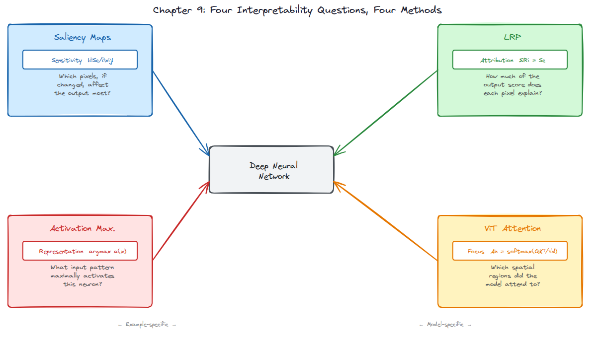

*__Figure 1.__ Four questions, four methods. Saliency maps and LRP ask about a specific prediction. Activation Maximization asks about what a neuron has learned in general. ViT Attention exploits structure built directly into the Vision Transformer architecture.*

1. **Saliency Maps**: if I nudged this pixel, would the output change? 
2. **Deconvnet**: given that this deep feature fired, which input patch caused it?
3. **Layer-wise Relevance Propagation**: how much of the total prediction score does each pixel explain?
4. **ViT Attention**: which image regions did a Vision Transformer focus on?

These four are not competing methods. They answer genuinely different questions, and using them together is more informative than using any one alone.

---

## A Necessary Detour: Two Questions That Sound the Same

Before looking at any specific method, I want to dwell on a distinction that confused the field for years, and still trips people up.

Imagine a thermometer sitting near a hot oven. If you asked "does this thermometer reading *tell us about* the room temperature?", the answer is yes. If you asked "did this thermometer reading *cause* the room to be warm?", the answer is obviously no. These are different questions.

In neural network interpretability, the analogous confusion is between **sensitivity** and **attribution**.

**Sensitivity** asks: if I perturb pixel $x_{i,j}$ slightly, by how much does the class score $S_c(\mathbf{x})$ change? The answer is the partial derivative $\partial S_c / \partial x_{i,j}$, a local, instantaneous quantity. Think of it as the slope of the output surface at the current input.

**Attribution** asks: how much of the output $S_c(\mathbf{x})$ does pixel $x_{i,j}$ *explain*? This is a decomposition, not a slope. You want to slice the total prediction score and hand each pixel its share.

The gradient does not answer the attribution question. A pixel can sit exactly at an activation boundary, meaning any tiny change would sharply affect the output, while contributing almost nothing to the current prediction, because the neuron it drives is currently inactive. High sensitivity, near-zero attribution.

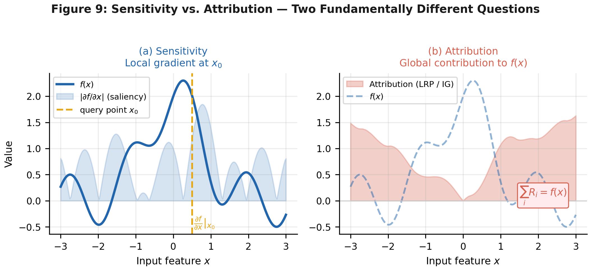

*__Figure 2.__ Sensitivity (left) measures local slope at $x_0$ which is the tangent to the function. Attribution (right) asks how much of $f(x)$ each feature is responsible for, summing to the output value. These diverge on any nonlinear function, which includes every neural network with ReLU activations.*

Saliency maps give you sensitivity. LRP gives you attribution. Applying one when you need the other gives a visually plausible but conceptually wrong answer and this is precisely the kind of subtle error Adebayo et al. (2018) uncovered when they showed that widely used saliency methods sometimes produce identical maps for trained and random networks. If a method can't even distinguish "trained" from "random," something is wrong.

With that out of the way, let's look at the methods.

---

## Saliency Maps

### The Basic Idea

The idea is embarrassingly simple. Simonyan, Vedaldi, and Zisserman (2013) noticed that if you run backpropagation on a class score rather than a loss, the gradient you get at the input pixels tells you which pixels the network is currently "paying attention to." Pixels with large gradients are pixels where a small nudge would change the prediction the most.

Formally, for a class score $S_c$ and input $\mathbf{x}$:

$$M_{i,j} = \left| \frac{\partial S_c}{\partial x_{i,j}} \right|$$

Because the input has three colour channels, you compute a $3 \times H \times W$ gradient tensor and collapse it to $H \times W$ by taking the channel-wise maximum at each position.

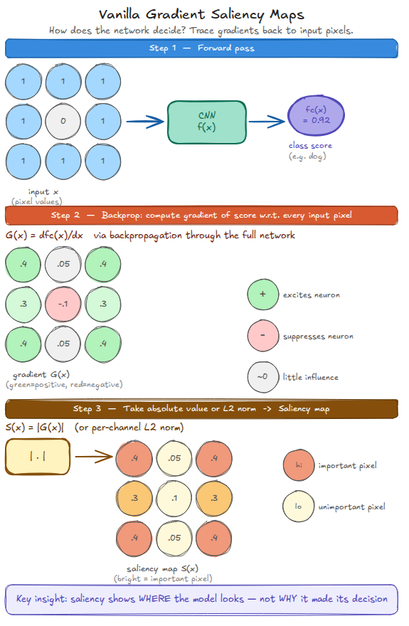

*__Figure 3.__ Three steps: forward pass to get the class score, backward pass to get the gradient at every input pixel, then take the absolute value to produce an unsigned map. Green values in the gradient indicate pixels that excite the prediction; red values suppress it.*

In code, this is a single backward pass:

```python
def vanilla_saliency(model, input_tensor, class_idx):
    x = input_tensor.clone().detach().requires_grad_(True)
    logits = model(x)
    score  = logits[0, class_idx]
    model.zero_grad()
    score.backward()
    saliency = x.grad.abs().squeeze(0)        # (3, H, W)
    saliency, _ = saliency.max(dim=0)         # (H, W) - max over channels
    return saliency.cpu().numpy()
```

Running this on a ResNet-18 classifying a Samoyed photograph produces:

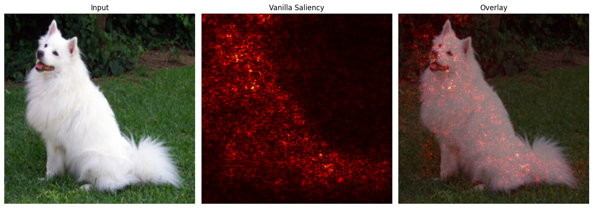

*__Figure 4.__ Vanilla saliency on a Samoyed photograph (ResNet-18, predicted class: "Samoyed"). The map loosely localizes to the dog, but scattered bright pixels appear across the background. This noisiness has a precise cause: deep ReLU networks have jagged gradient landscapes that flip sign near activation boundaries. One backward pass reads one unstable point in that landscape.*

The noisiness is not a bug in the implementation. It's an honest readout of a genuinely unstable gradient field. Neural networks are not trained to have smooth gradients because they are trained to classify images correctly, and these are not the same objective.

### SmoothGrad: Average the Instability Away

SmoothGrad (Smilkov et al., 2017) fixes this with a simple idea: run vanilla saliency $n$ times on noisy copies of the input, then average.

$$\hat{M}_c(\mathbf{x}) = \frac{1}{n} \sum_{i=1}^{n} M_c\!\left(\mathbf{x} + \mathcal{N}(0, \sigma^2)\right)$$

The intuition is that high-frequency gradient fluctuations are noise; they average to zero across different input perturbations. The signal (the pixel's actual importance) is more stable and survives the averaging.

```python
def smoothgrad(model, input_tensor, class_idx, n_samples=25, sigma=0.15):
    accumulated = torch.zeros_like(input_tensor[0, 0])
    std = sigma * (input_tensor.max() - input_tensor.min()).item()
    for _ in range(n_samples):
        noise   = torch.randn_like(input_tensor) * std
        noisy_x = (input_tensor + noise).clamp(input_tensor.min(), input_tensor.max())
        accumulated += torch.from_numpy(vanilla_saliency(model, noisy_x, class_idx))
    return (accumulated / n_samples).cpu().numpy()
```

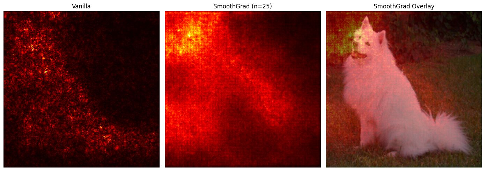

*__Figure 5.__ Left: vanilla saliency is scattered. Centre: SmoothGrad ($n=25$) where the dog's body dominates, background noise largely suppressed. Right: SmoothGrad overlaid on the original. Averaging across 25 perturbed copies removes the high-frequency gradient noise without changing the network architecture.*

### Deconvnet and the ReLU Question

Zeiler & Fergus (2014) built the **Deconvnet** not as a post-hoc analysis tool but as a core part of their training methodology. They used it to inspect what CNN filters had learned, then redesigned the filters when the visualizations looked wrong. It inverts the forward pass layer by layer to reconstruct the input pattern that caused a chosen neuron to fire.

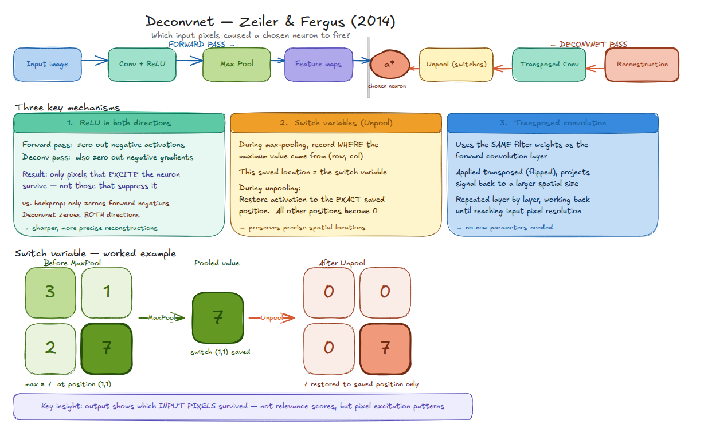

*__Figure 6.__ The Deconvnet runs the forward pass (Conv+ReLU → MaxPool → feature maps), then inverts it. Three mechanisms make the inversion possible: switch variables record which spatial position held the pooling maximum; transposed convolution uses the same weights in reverse; and ReLU is applied in both directions.*

Reversing max pooling requires a trick. Pooling is lossy as it discards the exact position that held the maximum. The Deconvnet records this as a **switch variable** during the forward pass, then routes signal back to that exact position during deconvolution. Every other position gets zero. This is what preserves spatial precision that naïve upsampling destroys.

The more interesting difference is how ReLU is handled during backpropagation:

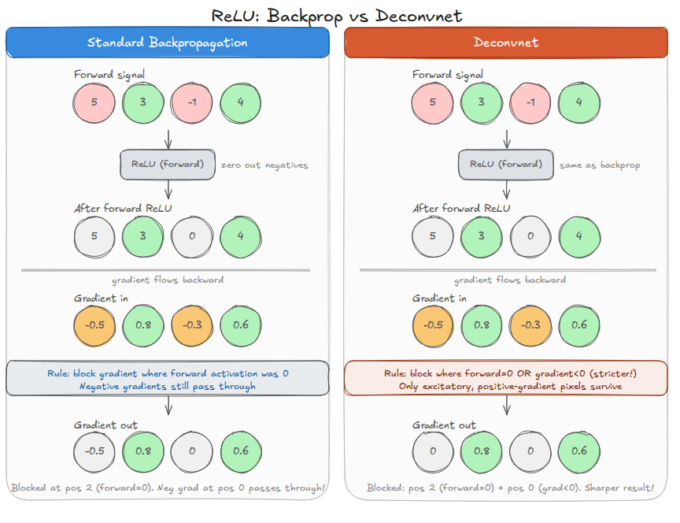

*__Figure 7.__ Both approaches receive the same forward signal $[5, 3, -1, 4]$; after forward ReLU: $[5, 3, 0, 4]$. With gradient-in $[-0.5, 0.8, -0.3, 0.6]$: standard backpropagation blocks where the forward activation was zero (position 2) but lets negative gradient $-0.5$ at position 0 pass through. The Deconvnet additionally blocks negative gradients, giving $[0, 0.8, 0, 0.6]$, so only excitatory signals survive.*

Standard backpropagation asks: where was the forward activation zero? The Deconvnet asks: where is the gradient negative *or* the forward activation zero? The second condition is stricter. The result is sharper reconstructions that show only the parts of the input that excited the neuron, not the parts that partially suppressed it.

**Guided backpropagation** (Springenberg et al., 2014) applies this second condition during standard gradient computation, producing maps that look almost photographic.

> **Warning: Sharp ≠ Faithful.** Guided backpropagation produces visually sharp maps that look like they're explaining the model's decision. Adebayo et al. (2018) ran a decisive test: compute guided backpropagation maps for a *trained* network and a *randomly initialized* network on the same input. The maps look nearly identical. This means the method is picking up something about the architecture, not the learned weights. It passes no sanity check. Vanilla gradients and SmoothGrad, by contrast, do change when weights are randomized. Sharp output is not evidence of faithfulness.

### What Saliency Maps Are and Are Not

Saliency maps answer a **sensitivity** question. That's it. They do not tell you how much a pixel contributed to the prediction, only whether the model was locally sensitive to changes in that pixel. For many diagnostic use cases, sensitivity is the right question. For comparing explanations across inputs, or understanding what the model is actually computing, you need attribution.

---

## Layer-wise Relevance Propagation

### The Core Idea: Conservation

Think of the prediction score $S_c(\mathbf{x})$ as a fixed amount of money. Layer-wise Relevance Propagation (Bach et al., 2015) traces this money backward through the network, distributing it proportionally at each junction. By the time it reaches the input pixels, every pixel holds its share: positive if it pushed the prediction up, negative if it pushed it down, and the shares sum exactly to the original prediction.

$$\sum_{i \in \text{input}} R_i = \sum_{j \in \text{layer 1}} R_j = \cdots = S_c(\mathbf{x})$$

This conservation law is what separates LRP from gradient methods. The total relevance is $S_c(\mathbf{x})$, a specific number with a direct interpretation tied to the model output. Relevance values from different inputs can be compared meaningfully; saliency magnitudes generally cannot.

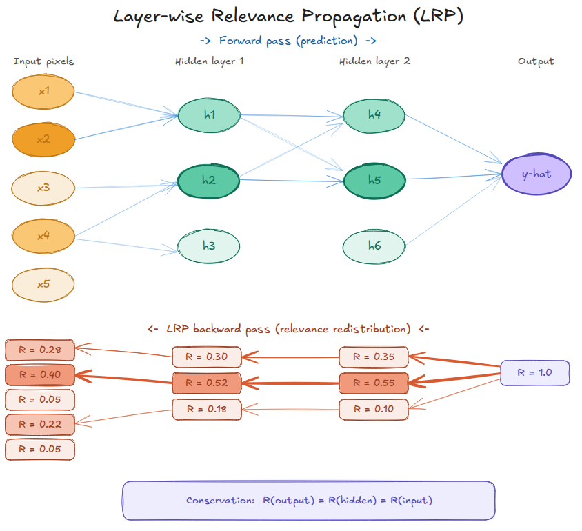

*__Figure 8.__ LRP conservation on a 4-layer network. At every layer, input, two hidden layers, output, the sum of all relevance values equals $R_\text{output} = 1.0$. Relevance flows backward through the redistribution rule, splitting proportionally at each junction. Nothing is created or destroyed.*

### The Redistribution Rule

For a linear layer with pre-activation $z_j = \sum_i a_i w_{ij}$, the simplest rule, **LRP-0**, redistributes each neuron's relevance backward proportional to its weighted input:

$$R_i = \sum_j \frac{a_i w_{ij}}{z_j} R_j$$

Three refinements handle real networks:

**LRP-$\varepsilon$** adds a small stabilizer to the denominator, suppressing contributions from neurons that barely activated. The result is sparser, more focused maps: fewer spurious attributions.

**LRP-$\gamma$** tilts redistribution toward positive contributions: $R_i = \sum_j \frac{a_i(w_{ij} + \gamma w_{ij}^+)}{Z_j} R_j$. This works best in lower convolutional layers where positive feature detectors dominate.

**The composite strategy** (Montavon et al., 2019) combines all three: LRP-$\gamma$ in lower convolutional layers, LRP-$\varepsilon$ in upper layers and fully connected classifier. This is the configuration that makes LRP work reliably on standard deep CNNs like VGG-16.

A subtlety worth knowing: input pixels, after ImageNet normalization, are not non-negative; they range from roughly $-2.1$ to $2.6$. Standard LRP assumes non-negative activations, so the pixel layer needs special handling via the **$z^\mathcal{B}$ rule**, which routes relevance through three parallel forward computations that account for the bounded pixel range.

### What LRP Looks Like in Practice

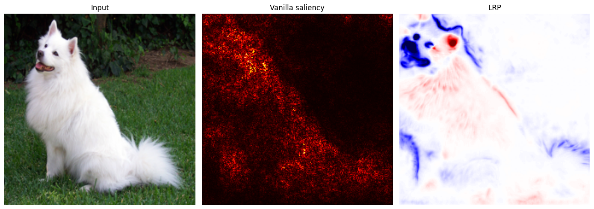

*__Figure 9.__ Left: input image (Samoyed). Centre: vanilla saliency, unsigned, distributed, no consistent interpretation of sign. Right: LRP map, signed. Red regions support the "Samoyed" prediction; blue regions suppress it. The map concentrates positive relevance on the dog's head and body while flagging background patches as actively working against the classification.*

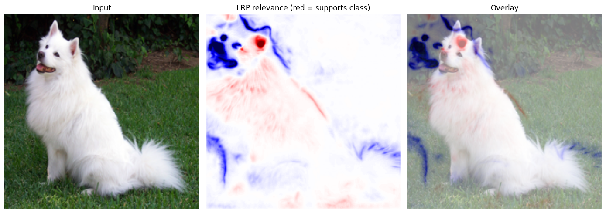

*__Figure 10.__ LRP relevance overlaid on the input. Positive relevance (red) concentrates on the dog's face and upper body; patches of background grass generate negative relevance (blue). A clinician seeing this on a chest X-ray would know not only which regions the model examined, but which ones supported versus contradicted the diagnosis.*

The practical significance of sign is hard to overstate. Saliency maps show you where the model is sensitive. LRP shows you which pixels are working *for* the prediction and which are working *against* it. This is completely invisible to any gradient-based saliency method.

### Limitations

A few honest caveats.

The composite rule strategy is chosen empirically, not derived from first principles. Different rule schedules produce different maps, and there is no universally agreed ground truth for which is "correct." The conservation law constrains the *form* of the explanation; it does not guarantee the explanation is *faithful* to what the network actually computes.

Non-standard architectures need custom rules. Skip connections in ResNets, batch normalization, and attention mechanisms all require bespoke handling. Libraries like Zennit and Captum cover common cases, but novel architectures need expert adaptation.

Propagating relevance backward through max-pooling via the hard-maximum path also creates problems. The standard workaround, replacing MaxPool with AvgPool during LRP's backward pass, means the explanation technically describes a slightly different network from the one that made the prediction.

---

## Activation Maximization

Saliency maps and LRP are prediction-specific: give me this image, and I will tell you which pixels mattered for this prediction. Activation Maximization asks a fundamentally different question: *setting aside any particular input, what pattern of pixels would cause this neuron to fire as strongly as possible?*

The answer is found by gradient ascent on the input itself. Fix the network weights. Initialize $\mathbf{x}_0$ from random noise. Then iterate:

$$\mathbf{x}_{t+1} = \mathbf{x}_t + \eta \cdot \frac{\partial a(\mathbf{x}_t)}{\partial \mathbf{x}_t}$$

where $a(\mathbf{x})$ is the activation of the target neuron. Add an $\ell_2$ regularization term $\lambda \|\mathbf{x}\|^2$ to prevent pixel values from growing without bound:

$$\mathbf{x}^* = \arg\max_{\mathbf{x}} \; a(\mathbf{x}) - \lambda \|\mathbf{x}\|^2$$

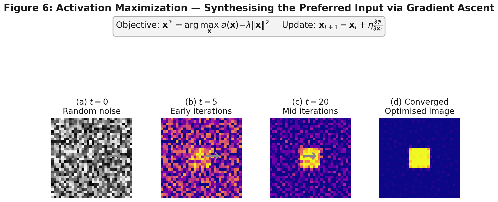

*__Figure 11.__ Gradient ascent from random noise. Early iterations (b) show structure emerging. By convergence (d), the result is a bright square on a dark background, the precise pattern that maximally activates this neuron. This is not a failure of the method; it is what the neuron learned to detect.*

The results look strange. For a neuron associated with the "dog" class, the optimized image is not a photograph of a dog; it is the exact high-frequency statistical pattern that co-occurs with dogs in ImageNet. The features a neuron responds to are not the same as the human concept it classifies. This gap between machine representation and human concept is one of the deepest open questions in AI alignment, and activation maximization makes it visible in a way that prediction-specific methods cannot.

Naive gradient ascent produces abstract textures. Regularization makes results more interpretable: **$\ell_2$ weight decay** penalizes large pixel values; **Gaussian blur** applied periodically encourages spatial coherence; **total variation penalty** enforces piecewise smoothness.

**Deep Generative Network AM (DGN-AM)** (Qin et al., 2018) replaces pixel-space optimization with optimization in the latent space of a GAN:

$$\mathbf{z}^* = \arg\max_{\mathbf{z}} \; a(G(\mathbf{z})) - \lambda \|\mathbf{z}\|^2$$

Since $G$ has learned to produce naturalistic images, $G(\mathbf{z}^*)$ looks like a plausible photograph. The difference in output quality is stark:

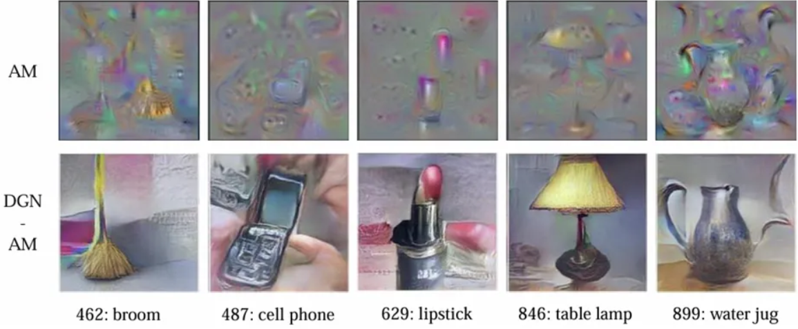

*__Figure 12.__ Activation Maximization (top row) versus DGN-AM (bottom row) for five ImageNet classes. Standard AM yields abstract textures. DGN-AM, constrained to the natural image manifold, produces recognizable objects: a broom, a flip phone, lipstick, a table lamp, a water jug. (Images from Qin et al., 2018.)*

Activation Maximization is the only method in this chapter that is *example-independent*. It probes what the model has learned in the abstract, divorced from any particular input. The psychedelic character of naive outputs is a finding about deep network representations, not a failure. Those representations are genuinely alien to human conceptual categories.

---

## Attention in Vision Transformers

### A Different Kind of Architecture

Vision Transformers (Dosovitskiy et al., 2020) approach images differently from CNNs. Rather than sliding convolutional filters across pixels, a ViT divides an image into non-overlapping $16 \times 16$ patches, embeds each patch as a token, prepends a learnable class token (CLS), adds positional encodings, and processes the full sequence through transformer blocks.

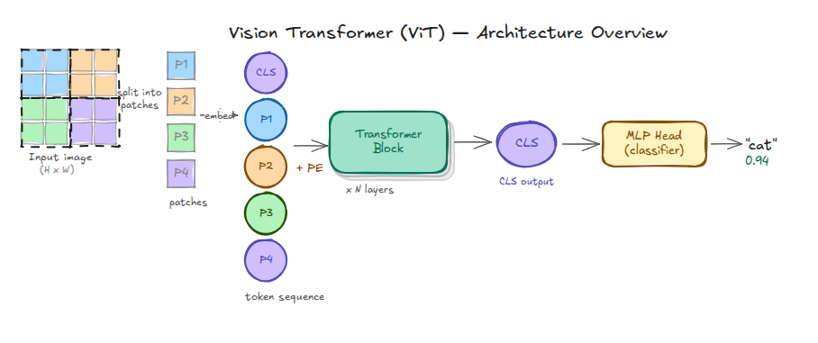

*__Figure 13.__ ViT architecture overview. The input image is split into patches, each embedded as a token. CLS is prepended. After $N$ transformer blocks, the CLS token aggregates global context and feeds into an MLP classifier. The attention weights produced at each block are directly accessible.*

Each transformer block computes multi-head self-attention. For head $h$:

$$A_h = \text{softmax}\!\left(\frac{Q_h K_h^\top}{\sqrt{d_k}}\right) \in \mathbb{R}^{N \times N}$$

The entry $A_h[i, j]$ measures how strongly token $i$ attends to token $j$. Row 0, the CLS token's row, tells you which patches the classification head "looked at" when forming its summary representation. This is interpretability for almost free: the model's internal attention weights are directly accessible as intermediate quantities, no backward pass required.

### Reading Attention Maps

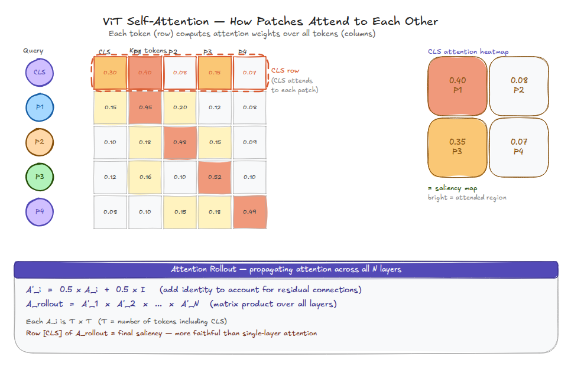

*__Figure 14.__ ViT self-attention (simplified to 5×5; real models have 197×197). Row 0, the CLS row, shows how the classification token weights each patch. The 2×2 heatmap reshapes this row into a spatial map. Below: the Attention Rollout formula, which aggregates attention flow across all layers.*

Extracting the attention maps from a ViT requires a forward hook:

```python
attention_maps = []

def attn_hook(module, inputs, output):
    attention_maps.append(inputs[0].detach().cpu())

hooks = [
    block.attn.attn_drop.register_forward_hook(attn_hook)
    for block in model.blocks
]
with torch.no_grad():
    logits = model(x)
for h in hooks:
    h.remove()

# CLS→patches for layer L, head H:
# attention_maps[L][0, H, 0, 1:]  → reshape to (14, 14)
```

Attention patterns evolve considerably across layers:

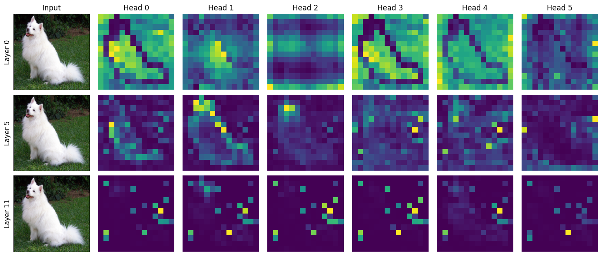

*__Figure 15.__ CLS→patch attention for 6 heads across layers 0, 5, and 11 (ViT-S/16). Layer 0 (top): diffuse, attending broadly. Layer 5 (middle): beginning to localize on the dog's body. Layer 11 (bottom): sparse and fragmented, because the CLS token has already absorbed global context, so individual patch attention is less concentrated.*

The full layer-by-layer evolution is shown below:

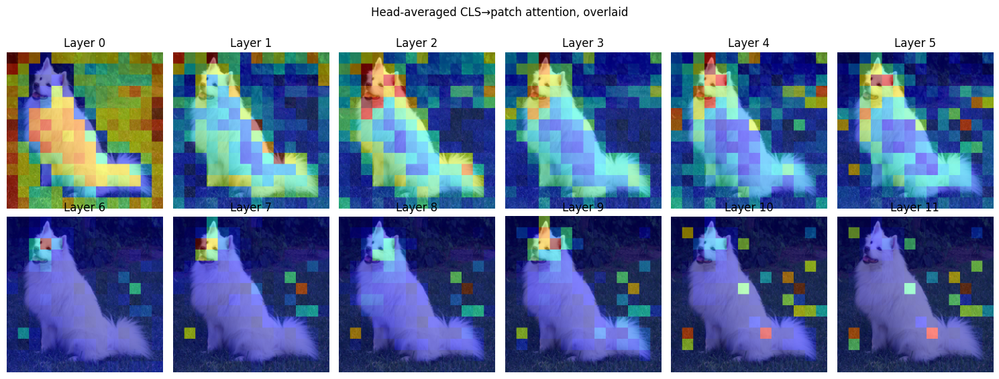

*__Figure 16.__ CLS attention across all 12 layers, overlaid on the input. Early layers (0–5) attend diffusely across the image; later layers concentrate increasingly on the dog, then become sparse and selective as global context flows into the CLS representation.*

### Attention Rollout

Single-layer attention is noisy. Attention Rollout (Abnar & Zuidema, 2020) propagates attention across all $L$ layers, accounting for the residual connections that carry information alongside the attention pathway:

$$\hat{A}_i = 0.5 \cdot A_i + 0.5 \cdot I \qquad A_\text{rollout} = \hat{A}_1 \times \hat{A}_2 \times \cdots \times \hat{A}_L$$

The identity term accounts for the residual stream, a correction that is easy to miss but produces substantially more coherent maps. Row [CLS] of $A_\text{rollout}$ is the final saliency.

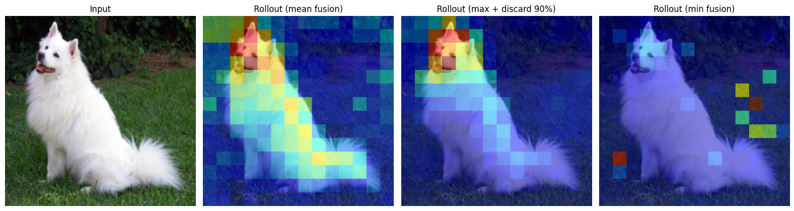

*__Figure 17.__ Attention Rollout with mean, max+discard 90%, and min fusion. Mean fusion (second from left) produces the most coherent localization of the dog. Max fusion with thresholding highlights a tighter region. Min fusion is dominated by inattentive heads and produces a fragmented result.*

### A Critical Note on Attention as Explanation

Attention weights are not attribution scores. Jain & Wallace (2019) showed that attention distributions can be modified substantially without changing predictions, and that swapping in adversarial attention distributions produces the same output in some models. Wiegreffe & Pinter (2019) disputed parts of this finding, but the debate remains open. The short version: attention tells you *where* the model focused, not *why* that focus led to this decision. For high-stakes applications, supplement attention maps with at least one gradient-based method.

DINO (Caron et al., 2021) provides a striking demonstration of what self-supervised ViT attention can do unprompted:

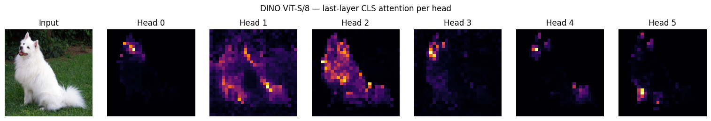

*__Figure 18.__ DINO ViT-S/8 last-layer CLS attention, one map per head. Each head has spontaneously learned to attend to a different semantic region of the dog: the face, the body outline, the background contrast. No segmentation objective was ever specified during training. Whether this counts as genuine interpretability or a useful coincidence of self-supervised training is a question worth sitting with.*

---

## All Four Methods, Side by Side

| Dimension | Saliency Maps | Deconvnet | LRP | ViT Attention |
|---|---|---|---|---|
| **Core question** | Sensitivity | Reconstruction | Attribution | Focus |
| **Scope** | Example-specific | Example-specific | Example-specific | Example-specific |
| **Output** | Unsigned pixel map | Pixel reconstruction | Signed, conserved pixel relevance | Spatial attention heatmap |
| **Architectures** | Any differentiable | CNN only | Any (with custom rules) | Transformer only |
| **Sanity check** | Passes (vanilla/SmoothGrad) | Fails (Guided BP) | Passes | Contested |
| **Compute** | One backprop | One deconv pass | One forward + layerwise backward | Near-zero (from forward pass) |
| **Signed output** | No | No | Yes | Directionally (rollout) |
| **Conservation** | No | No | Yes | No |

*__Table 1.__ The four methods along interpretability-relevant dimensions.*

And here they are applied to the same input:

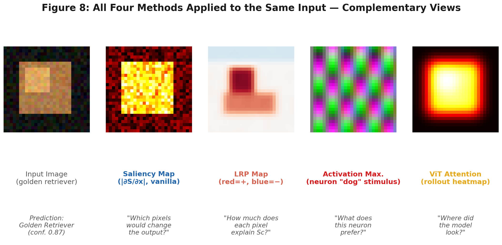

*__Figure 19.__ All four methods applied to the same golden retriever image (predicted: "golden retriever," confidence 0.87). From left: input image; vanilla saliency (unsigned, noisy); LRP relevance (red = supports, blue = opposes); activation maximization output for the "dog" neuron (abstract texture); ViT attention rollout (smooth, concentrated on the subject). Each method reveals something the others do not.*

**When to use what:**

Use **vanilla saliency or SmoothGrad** for rapid debugging. Fast, require no architectural adaptation, pass the sanity check. Do not use Guided Backpropagation anywhere faithfulness matters.

Use **Deconvnet** when you need to understand what a specific deep feature has learned to detect. It is uniquely suited to the reconstruction question, and Zeiler & Fergus's layer-by-layer visualizations remain among the most informative published analyses of CNN representations.

Use **LRP** when you need signed attribution, which regions support the prediction and which suppress it, or when you want to compare explanations meaningfully across inputs. The conservation guarantee gives absolute relevance values that saliency magnitudes cannot provide.

Use **Attention Visualization** for transformer models when a quick spatial focus indicator is sufficient. Supplement with a gradient-based method for anything consequential.

The most credible interpretability analyses use multiple methods and look for convergence. When saliency, LRP, and attention all flag the same image region, that convergence is real evidence. One method finding something is interesting. Three finding the same thing is harder to dismiss.

---

## Ethics, Regulation, and the Limits of Looking Inside

### What the Law Says

The EU AI Act (2024), in force since August 2024, classifies certain applications, biometric identification, medical devices, creditworthiness assessment, as high-risk and mandates transparency requirements. The methods in this chapter are among the practical tools for meeting those requirements, but none of them maps cleanly onto the regulatory language.

GDPR Article 22 established a "right to explanation" for individuals subject to purely automated decisions with significant effects. European courts have tended to interpret this as requiring explanations specific to the individual rather than statistical generalities. LRP relevance maps, signed, per-pixel, tied to the model's actual prediction for that specific input, are more likely to satisfy this than aggregate feature importance scores. But whether a pixel-level heatmap constitutes a "meaningful explanation" in the Act's sense remains genuinely unclear.

### The False Confidence Problem

There is a failure mode worse than no explanation: an explanation that looks right but is not. The Adebayo et al. (2018) sanity-check results made this concrete. A clinician shown a Guided Backpropagation map highlighting the correct anatomical region might increase their trust in a model's diagnosis, precisely because the map looks right for reasons entirely unrelated to what the model actually computed. This is arguably more dangerous than showing no explanation at all: it introduces false confidence rather than honest uncertainty.

Any deployment of interpretability tools in a consequential domain should include **faithfulness evaluation** alongside visual inspection. Faithfulness metrics, quantitative tests measuring whether removing the highlighted pixels actually reduces the prediction score, are not perfect, but they are more rigorous than visual plausibility.

### Who Is the Explanation For?

Different stakeholders need different explanations, and the same method can be appropriate for one and misleading for another.

An engineer debugging a model needs pixel-level sensitivity; saliency maps work. A radiologist using a diagnostic aid needs to know which anatomical structure drove the prediction, at a coarser semantic level than individual pixels, and neither saliency nor LRP directly provides this. A regulator auditing a hiring algorithm needs to know whether protected attributes influenced the model, and none of the methods in this chapter addresses that directly; you need the feature-attribution tools from Chapter 5.

This mismatch between method capability and stakeholder need is one of the most persistent unresolved tensions in XAI. Chapter 10 (Healthcare Applications) and Chapter 11 (Finance) examine how practitioners navigate it in real deployments.

### Post-hoc Is Not Post-truth

Every method in this chapter is post-hoc: it analyses a trained model rather than shaping what the model learns. Post-hoc explanations describe what the model *appears* to be doing. They cannot guarantee that what it appears to do is what it actually does.

Lipton (2018) made this point bluntly in a paper that the field needed to hear: "interpretability" covers many different desiderata, and most post-hoc methods satisfy only some of them. The alternative, building interpretability in from the start through prototype-based architectures or training objectives that reward human-aligned representations, is active research and is previewed in Chapter 8. For deep networks as they currently exist in production, post-hoc explanation remains the primary practical tool. Using it well requires understanding its limits as clearly as its capabilities.

---

## Exercises

### Conceptual

1. Construct a toy example, algebraic or geometric, where a pixel has high sensitivity but near-zero attribution, and another where it has low sensitivity but high attribution. What does each scenario tell you about the relationship between the gradient and the model's actual computation?

2. The LRP conservation law $\sum_i R_i^{(\text{input})} = S_c(\mathbf{x})$ is sometimes compared to conservation of charge in circuit theory. Where does the analogy hold? Where does it break down?

3. Guided Backpropagation fails the Adebayo et al. (2018) sanity check yet produces visually sharper maps than vanilla gradients, which pass. What does this tell us about the relationship between visual quality and faithfulness? Under what circumstances, if any, might a method that fails sanity checks still be useful?

4. Attention Rollout assumes the residual and attention paths contribute equally ($\hat{A} = 0.5(A + I)$). Empirical probing studies (Elhage et al., 2021) suggest the residual stream often dominates information flow. How would you modify Rollout to reflect this? What would you need to know about the model to make a principled adjustment?

5. DINO's spontaneous foreground segmentation emerges from a self-supervised objective that never specified segmentation. Does this count as *interpretation* of the model, or is it a coincidental property of self-supervised training? What would it take for an emergent property to be *reliably* interpretable across inputs?


### Reflective

1. A radiologist says: "I only trust this AI system if it can show me what it is looking at." Saliency maps seem to answer this. Under what conditions is a saliency map a *sufficient* response to this concern? Under what conditions is it insufficient or potentially misleading? What additional information would responsible deployment need to provide?

2. The EU AI Act requires explanations for individuals affected by high-risk automated decisions. None of the methods in this chapter produces an explanation in natural language. Does a heatmap count as a "meaningful explanation" under the Act's intent? What would it take to bridge pixel-level attributions and human-intelligible justifications?

3. Activation maximization reveals that neurons in deep networks respond to patterns that do not correspond to human-nameable concepts. Does this mean those representations are *wrong*, a failure that should be corrected? Or does it mean machine feature hierarchies and human conceptual categories are simply *incommensurable*, two valid but different ways of organizing visual information? What are the implications of each answer for AI alignment?

---

## Exercise Answers

### Conceptual

**1. High sensitivity, near-zero attribution (and vice versa)**

Take a ReLU network with one hidden neuron $h = \text{ReLU}(w_1 x_1 + w_2 x_2)$ and output $f = w_3 h$.

*High sensitivity, near-zero attribution.* Let $x_1 = 0$, $x_2 = -0.01$, $w_1 = 100$, $w_2 = 1$, $w_3 = 1$. The pre-activation is $-0.01$, so $h = 0$ and $f = 0$. Pixel $x_1$ has $\partial f / \partial x_1 = w_1 w_3 \cdot \mathbf{1}[h > 0] = 0$... but a tiny positive nudge pushes the pre-activation positive and fires the neuron, producing a very large change. Set $x_1 = +\varepsilon$; now $h = 100\varepsilon$ and $f = 100\varepsilon$. Sensitivity at the boundary is effectively infinite, yet the pixel's attribution to $f = 0$ is zero. It contributes nothing to the current prediction.

*Low sensitivity, high attribution.* Let $x_1 = 10$, $w_1 = 1$, $w_2 = 0$, $w_3 = 1$, and $h = \text{ReLU}(x_1) = 10$, so $f = 10$. The gradient $\partial f / \partial x_1 = 1$ is modest. But LRP traces the full relevance $R = 10$ back to $x_1$, which holds the entire explanation. The pixel contributes almost everything to the output even though a marginal perturbation changes things only proportionally.

The divergence is this: sensitivity reads a local slope; attribution accounts for the current operating point. They agree only for linear functions.

**2. LRP conservation and the circuit analogy**

*Where it holds.* In circuit theory, Kirchhoff's current law says charge is conserved at every node: current in equals current out. LRP's conservation law plays the same role, with relevance flowing into any neuron equaling relevance flowing out. Both are layer-local balance conditions that propagate globally. Neither creates nor destroys the "currency" being tracked (charge or relevance).

*Where it breaks down.* Circuit current is physically conserved; it cannot be negative at a node without changing direction. LRP relevance can legitimately be negative (pixels suppressing the prediction), and the conservation rule must be extended carefully when positive and negative relevance co-exist. More fundamentally, charge conservation follows from Maxwell's equations. It is not a modeling choice. LRP's conservation is imposed by the designer of the redistribution rule. A different rule, one that does not conserve, is mathematically valid; it just gives a different explanation. The analogy usefully communicates "nothing is created or destroyed," but it can mislead by suggesting the conservation law is physically necessary rather than deliberately engineered.

**3. Visual quality vs. faithfulness**

The Adebayo et al. results reveal a mismatch between two properties that are easy to conflate: visual naturalness and faithfulness. Guided backpropagation produces maps that look like edge-filtered versions of the input. They are sharp because they amplify image structure, and the human visual system reads structure as signal. Vanilla gradients produce noisier maps, but the noise is honest: it reflects a genuinely jagged gradient landscape.

The failure mode is that evaluators (human or automated) who judge explanations by how good they look will favor methods that fail sanity checks over methods that pass them.

A method that fails sanity checks could still be useful in narrow circumstances. If the task does not depend on learned weights at all, say identifying salient image regions for a photographer who does not care about a classifier's internals, Guided Backpropagation's output might be fit for purpose. But for model debugging, bias detection, or regulatory compliance, a method that produces identical maps for trained and random networks cannot be trusted.

**4. Modifying Rollout for residual stream dominance**

The standard Rollout formula weights the attention and identity terms equally: $\hat{A}_i = 0.5 A_i + 0.5 I$. If the residual stream dominates (meaning later layers add mostly skip-connection information rather than attention-weighted combinations), the identity weight should be higher.

A principled adjustment would look like $\hat{A}_i = \alpha_i A_i + (1 - \alpha_i) I$ where $\alpha_i \in [0, 1]$ is layer-specific. To set $\alpha_i$ you would need to measure how much of each layer's output variance comes from the attention path versus the residual path. This can be approximated with activation patching: zero out the attention contribution at layer $i$ and measure the change in the CLS representation; then zero out the residual and measure the change. The ratio gives an empirical $\alpha_i$.

This is consistent with Elhage et al. (2021), which shows that transformer circuits can route information primarily through the residual stream, with attention heads acting as selective read-write operations on top of a persistent representation. Rollout's equal-weight assumption is a pragmatic default, not a theoretically grounded one.

**5. DINO and interpretability**

DINO's foreground segmentation is genuinely surprising because no segmentation signal was present during training. The self-supervised objective (matching augmented views of the same image) rewards representations that are invariant to crop position and color jitter. Foreground/background segmentation turns out to be a useful side effect of that goal.

Whether this counts as "interpretation" depends on what interpretation means. If interpretation means revealing a property the model was trained to have, then DINO's attention maps do not qualify: the model was not trained to segment. If it means revealing a property the model actually has, regardless of intent, then the maps are a valid interpretation. The distinction matters for trust: emergent properties can disappear when the training distribution shifts, whereas trained properties are at least nominally stable by design.

For a property to be reliably interpretable across inputs, you would want consistency across seeds and training runs, stability across moderate distribution shifts, and a causal story for why the objective incentivizes that property. DINO's segmentation satisfies the first reasonably well and has an informal story for the third, but its behavior on out-of-distribution images is an open empirical question.

---

### Reflective

**1. Saliency maps and the radiologist's concern**

A saliency map is sufficient under roughly these conditions: the model has passed faithfulness evaluation (maps change meaningfully when the model is retrained from scratch or when relevant pixels are masked); the map's spatial resolution matches the clinical task (pixel-level highlights work for dermoscopy but may be too fine-grained for chest X-ray interpretation); and the radiologist has calibrated expectations, understanding that the map shows sensitivity rather than attribution, and that a bright pixel means "this region is locally important" not "this region is the clinical finding."

The map is insufficient or misleading when the method fails the Adebayo et al. sanity checks, when the clinical finding is relational or contextual rather than pixel-local, or when the radiologist treats the map as ground truth and stops exercising independent judgment.

Responsible deployment would also need prospective validation showing that saliency-augmented decisions reduce specific error types; training for radiologists on what the maps do and do not represent; and documentation of which method was used, since "saliency map" covers methods with very different properties.

**2. Heatmaps and meaningful explanation under the EU AI Act**

The EU AI Act's transparency requirements for high-risk systems (Article 13) and GDPR Article 22's "right to explanation" are framed in terms that assume human intelligibility. A pixel-level heatmap on a medical image is meaningful to a radiologist and opaque to a patient. For a regulator it falls somewhere in between.

Whether it qualifies probably depends on context and presentation. A bare heatmap with no legend, no clinical labeling, and no statement of what the model was looking at is unlikely to satisfy the Act's intent. The same heatmap embedded in a report that names the anatomical structure driving the decision, and describes why that structure is relevant, moves closer to compliance.

Bridging pixel-level attributions and human-intelligible justifications would likely require semantic segmentation of the attribution map into named anatomical or decision-relevant regions, natural language generation grounded in those regions, and human expert validation that the generated language matches clinical reasoning. None of this is fully solved; it is an active research area.

**3. Alien representations and AI alignment**

The fact that neurons respond to abstract textures rather than human concepts admits at least two readings.

*The failure reading.* Human-nameable concepts are the right level of abstraction for safe deployment. If a model classifies "dog" by detecting high-frequency gabor-like textures that correlate with fur, it will fail whenever that texture appears in non-dog contexts (texture adversarial examples), and it cannot explain its decisions in terms that allow human oversight. From this view, alien representations are a defect to be corrected, whether through training objectives that reward human-aligned concepts or through architectures that explicitly represent named entities.

*The incommensurability reading.* Evolution did not give humans the optimal feature hierarchy for visual classification; it gave humans a feature hierarchy for survival in a particular ecological niche. A neural network trained on ImageNet learned features that are optimal for ImageNet classification. These are different tasks. Neither representation is wrong; they are adapted to different objectives. The goal, from this view, is not to make the machine's representation match the human's, but to build interfaces between them: tools that translate rather than tools that force conformity.

The alignment implications diverge. The failure reading suggests that safe AI requires interpretable-by-construction models, since post-hoc explanation of alien representations is unreliable. The incommensurability reading suggests that validated translation tools are sufficient, which is a more tractable engineering problem, though it still requires solving the faithfulness problem first.


---

## References

Abnar, S., & Zuidema, W. (2020). Quantifying attention flow in transformers. *Proceedings of the 58th Annual Meeting of the Association for Computational Linguistics (ACL)*, 4190–4197.

Adebayo, J., Gilmer, J., Muelly, M., Goodfellow, I., Hardt, M., & Kim, B. (2018). Sanity checks for saliency maps. *Advances in Neural Information Processing Systems (NeurIPS)*, 31.

Bach, S., Binder, A., Montavon, G., Klauschen, F., Müller, K.-R., & Samek, W. (2015). On pixel-wise explanations for non-linear classifier decisions by layer-wise relevance propagation. *PLOS ONE*, 10(7), e0130140.

Caron, M., Touvron, H., Misra, I., Jégou, H., Mairal, J., Bojanowski, P., & Joulin, A. (2021). Emerging properties in self-supervised vision transformers. *Proceedings of ICCV*, 9650–9660.

DeGrave, A. J., Janizek, J. D., & Lee, S.-I. (2021). AI for radiographic COVID-19 detection selects shortcuts over signal. *Nature Machine Intelligence*, 3(7), 610–619.

Dosovitskiy, A., et al. (2020). An image is worth 16×16 words: Transformers for image recognition at scale. *ICLR 2021*. arXiv:2010.11929.

Elhage, N., et al. (2021). A mathematical framework for transformer circuits. *Transformer Circuits Thread*. https://transformer-circuits.pub/2021/framework/index.html

European Commission (2024). *Regulation (EU) 2024/1689 of the European Parliament and of the Council laying down harmonised rules on Artificial Intelligence (Artificial Intelligence Act)*. Official Journal of the European Union.

Hui, K. E. (2024). Techniques of feature visualisation: Activation maximisation in convolutional neural networks. *Medium*. https://medium.com/@hke22/techniques-of-feature-visualisation-activation-maximisation-in-convolutional-neural-networks-07443d822380

Jain, S., & Wallace, B. C. (2019). Attention is not explanation. *Proceedings of NAACL-HLT*, 3543–3556.

Lipton, Z. C. (2018). The mythos of model interpretability. *Queue*, 16(3), 31–57.

Montavon, G., Samek, W., & Müller, K.-R. (2018). Methods for interpreting and understanding deep neural networks. *Digital Signal Processing*, 73, 1–15.

Montavon, G., Binder, A., Lapuschkin, S., Samek, W., & Müller, K.-R. (2019). Layer-wise relevance propagation: An overview. In *Explainable AI: Interpreting, Explaining and Visualizing Deep Learning* (pp. 193–209). Springer.


Narla, A., Kuprel, B., Sarin, K., Novoa, R., & Ko, J. (2018). Automated classification of skin lesions: From pixels to practice. *Journal of Investigative Dermatology*, 138(10), 2108–2110.

Qin, Z., Yu, F., Liu, C., & Chen, X. (2018). How convolutional neural networks see the world. *Mathematical Foundations of Computing*, 1(2), 149–180. arXiv:1804.11191.

Simonyan, K., Vedaldi, A., & Zisserman, A. (2013). Deep inside convolutional networks: Visualising image classification models and saliency maps. *Workshop at ICLR 2014*. arXiv:1312.6034.

Smilkov, D., Thorat, N., Kim, B., Viégas, F., & Wattenberg, M. (2017). SmoothGrad: Removing noise by adding noise. *arXiv preprint arXiv:1706.03825*.

Springenberg, J. T., Dosovitskiy, A., Brox, T., & Riedmiller, M. (2014). Striving for simplicity: The all convolutional net. *Workshop at ICLR 2015*. arXiv:1412.6806.

Wiegreffe, S., & Pinter, Y. (2019). Attention is not not explanation. *Proceedings of EMNLP*, 11–20.

Zeiler, M. D., & Fergus, R. (2014). Visualizing and understanding convolutional networks. *ECCV*, 818–833.

---

*To cite this chapter:*

```bibtex
@misc{hegazy_2026_XAI,
  author       = {Amr Hegazy},
  title        = {Interpreting Machine Learning: A Gentle Introduction, Chapter 9},
  year         = {2026},
  publisher    = {GitHub},
  howpublished = {\url{https://github.com/amrmsab/interpreting_machine_learning}},
}
```