# Chapter 7: Mechanistic Interpretability in Transformers

**Author:** [Merna Senger](www.linkedin.com/in/merna-senger-739586299)

---

## 1. How Do You Find an Emotion Inside a Neural Network?

In April 2026, Anthropic posted on X that their interpretability team had found internal representations of emotion concepts inside Claude that can causally drive its behavior (Anthropic, 2026):

> *"All LLMs sometimes act like they have emotions. But why? We found internal representations of emotion concepts that can drive Claude's behavior, sometimes in surprising ways."*

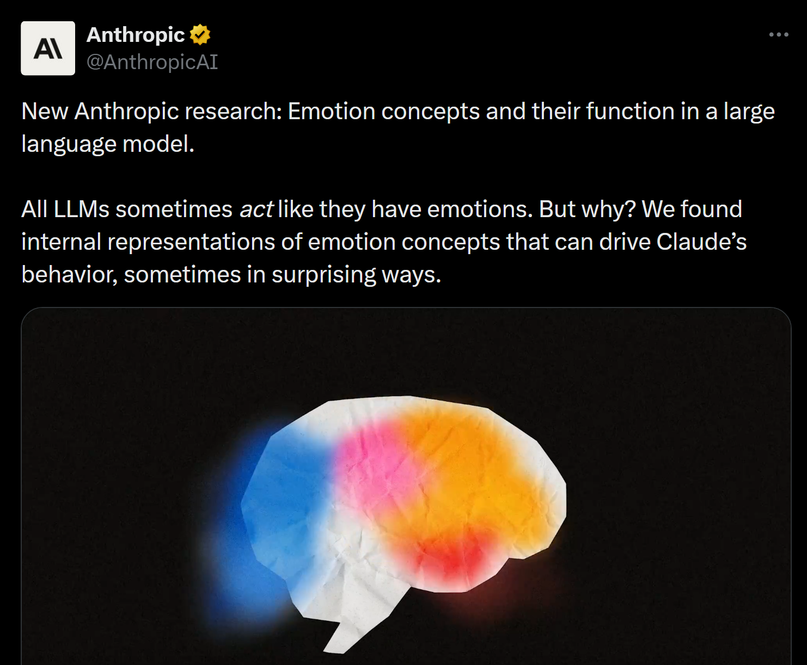

*Figure 1. Anthropic's April 2026 post discussing internal emotion representations in Claude. Source: https://x.com/AnthropicAI/status/2039749628737019925. This is a public announcement, not a peer-reviewed publication; the underlying methodology follows directly from Scaling Monosemanticity (Templeton et al., 2024), discussed in Section 5.*

The post raised a natural question: *how* do you even study something like that? How do you look inside a neural network and find an emotion?

That question is exactly what this chapter is about.

The field is called **mechanistic interpretability**, and the goal is to reverse-engineer neural networks the way a biologist reverse-engineers a brain: not just observing behavior, but tracing computation. Finding the circuits. Reading the weights. Understanding not just *what* the model says, but *why*.

Before we dive in, it helps to know where mechanistic interpretability sits relative to what came before it. Chapter 6 covered saliency maps and activation maximization, methods that explain what the model pays attention to *in a given input*. Those are powerful tools, but they work *around* the model. Mechanistic interpretability works *inside* it. The difference is important: a saliency map tells you which pixels mattered for this prediction; mechanistic interpretability tells you which weights stored the knowledge that generated it, and how that knowledge was retrieved. If saliency maps show you *which pixels mattered*, mechanistic interpretability shows you *the algorithm that processed them*.


This chapter walks through three papers that form the foundation of this field:

1. **Zoom In: An Introduction to Circuits** (Olah et al., 2020): are neural networks interpretable at all?
2. **Locating and Editing Factual Associations in GPT** (Meng et al., 2022): can we find *exactly* where a fact lives, and change it?
3. **Towards Monosemanticity** (Bricken et al., 2023): what are the real units of knowledge inside a model?

Each one opens the black box a little further. By the end, you will understand exactly how the Anthropic emotion finding was made, and why it matters.

To understand how researchers trace these internal computations, we first need a basic picture of what exists inside a transformer model.

---

## 2. What Is Inside a Transformer?

Large language models (GPT, Claude, Gemini) are all built on the same architecture: the **transformer**, introduced by Vaswani et al. (2017). At its core, an autoregressive language transformer such as GPT predicts the next token given the previous context. The remarkable thing is that this simple objective, trained at massive scale, produces systems that can reason, write code, answer questions, and apparently develop internal emotional representations. Everything in modern language models emerges from next-token prediction.

A transformer processes text through a sequence of repeating blocks. Each block mainly contains two components:

1. **Multi-Head Self-Attention (MHSA)**
2. **MLP layers (feed-forward networks)**

Both components communicate through a shared vector space called the **residual stream**, which we will examine shortly
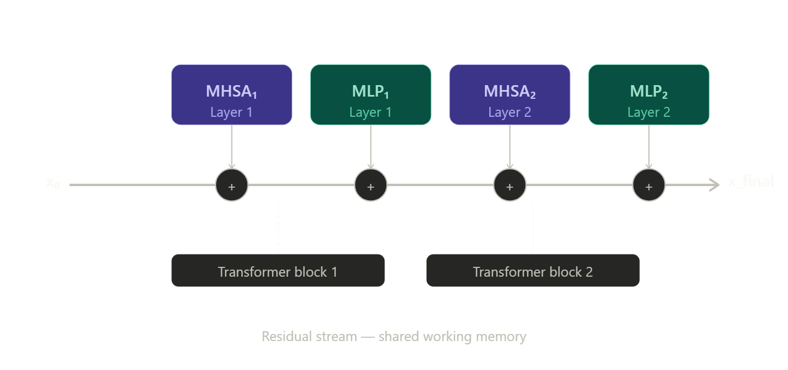

*Figure 2. Simplified transformer architecture. Each transformer block contains a Multi-Head Self-Attention (MHSA) layer and an MLP layer. Both write additively into the residual stream, which acts as the model's shared working memory. Figure adapted from Vaswani et al. (2017) and Elhage et al. (2021).*


### 2.1 Attention: How Tokens Find Relevant Information

Attention allows each token to look at all previous tokens and decide which ones matter most (Vaswani et al., 2017).

Consider the sentence:

> "The cat sat on the mat because *it* was tired."

When the model processes the word "*it*", it needs to determine what "*it*" refers to. Is it the cat? The mat? Something else?

To do this, every token creates three vectors:

- **Query (Q)** → *What information am I looking for?*
- **Key (K)** → *What kind of information do I contain?*
- **Value (V)** → *What information should I pass forward if selected?*

For the token "*it*", the **Query** might represent something like:

- "I am looking for a singular noun"
- "I am looking for a possible subject"
- "I am looking for something that could plausibly be tired"

For the token "*cat*", the **Key** might encode:

- singular noun
- animal
- animate entity
- grammatical subject

Because the Query from "*it*" matches strongly with the Key from "*cat*", attention gives "*cat*" a high score. The **Value** vector from "*cat*" is then passed forward, allowing the model to carry the relevant contextual information into later computations.

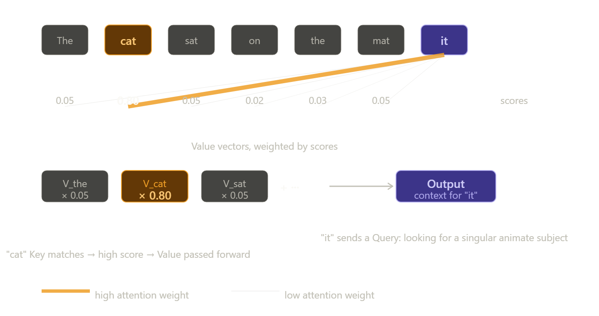

*Figure 3. Query-Key-Value attention mechanism applied to pronoun resolution. The token "it" generates a Query encoding "singular animate subject." The token "cat" produces a Key that matches strongly. Its Value vector is weighted at 0.80 and passed forward into the next computation. All weights sum to 1.0 after softmax. Adapted from Vaswani et al. (2017).*


Mathematically, the transformer compares Queries and Keys using a scaled dot product (Vaswani et al., 2017):

$$
\text{Attention}(Q,K,V)=\text{softmax}\left(\frac{QK^T}{\sqrt{d_k}}\right)V
$$

The dot products measure similarity: high similarity → strong attention, low similarity → weak attention. The scores are normalized using **softmax**, turning them into probabilities that sum to 1. The final output becomes a weighted combination of Value vectors:

```
attention weights:
cat = 0.80
mat = 0.10
sat = 0.10

output =
0.80 × V_cat +
0.10 × V_mat +
0.10 × V_sat
```

This is how the model decides what contextual information matters most at each step.

> **Check your understanding:** If we added a fourth token "dog" that was also a singular animate entity in the same sentence, would you expect the attention weight from "it" to "cat" to increase, decrease, or stay the same? Reason through this using the Query-Key matching logic before reading on.
>
> Take a moment to reason through this before reading the answer below.
>
> *Answer:* The attention weight from "it" to "cat" would **decrease**. Softmax normalizes all weights to sum to 1.0 over every token in the sequence. Adding "dog", which also has a high Query-Key dot product with "it", splits the probability mass that previously concentrated on "cat." Both "cat" and "dog" would receive roughly equal shares. This is why pronoun resolution with two equally plausible referents is computationally harder: attention confidence is diluted, and downstream computations receive a noisier signal.

### 2.2 Why Multiple Attention Heads Exist

One attention mechanism is limited: it can only specialize in a small number of relationships. So transformers use **multi-head attention**: several attention mechanisms running in parallel, each projecting into a lower-dimensional subspace (Vaswani et al., 2017).

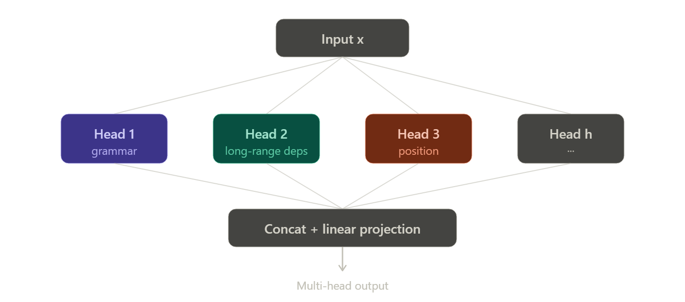

*Figure 4. Multi-head self-attention runs h attention mechanisms in parallel. Each head projects the input into its own Q, K, V subspace and learns to track a different type of relationship. Outputs are concatenated and linearly projected back to the original dimensionality. Adapted from Vaswani et al. (2017).*


Different heads often specialize in different patterns: one head may track grammar, another may track long-range dependencies, another may track positional relationships. These patterns are not manually programmed; they emerge during training through gradient descent, the process of iteratively adjusting weights to reduce prediction error (Vaswani et al., 2017). Researchers studying transformers have found concrete examples of specialized heads: heads that copy repeated patterns and heads that implement in-context learning behavior through a two-head mechanism called induction heads (Elhage et al., 2021; Olsson et al., 2022), as well as, in BERT-style encoders, heads that track grammatical agreement. Mechanistic interpretability tries to reverse-engineer these learned circuits.

### 2.3 The Residual Stream

The transformer's central communication channel is the **residual stream** (Elhage et al., 2021).

Every layer reads from it and writes back into it additively. Nothing is overwritten; each component simply adds new information to the current representation. Think of it as a whiteboard in a collaborative meeting: attention writes a note ("*it* refers to *cat*"), the MLP adds another ("*cat* is animate and singular"), and so on through all the layers. By the time the model reaches the final layer, the whiteboard holds an accumulation of every intermediate insight, and the next-token prediction reads from that accumulated surface.

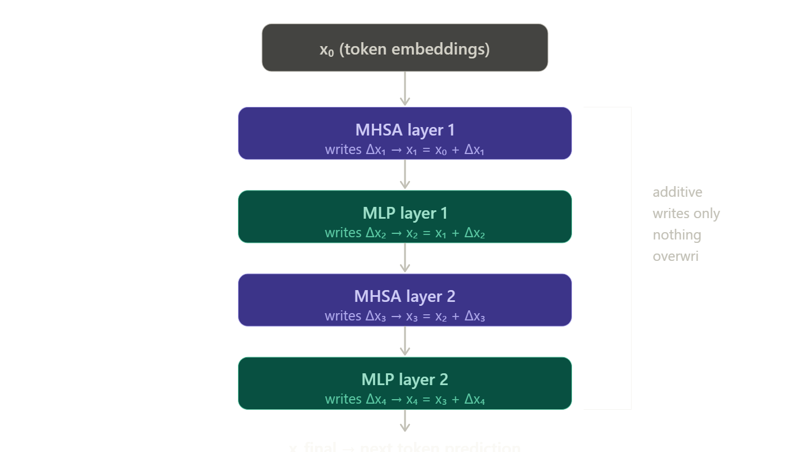

*Figure 5. Information flow through the residual stream. Attention layers and MLP layers both read from the current residual stream and write their outputs back additively. The representation at each layer is the cumulative sum of all previous contributions. Later layers build on all previous computations. Adapted from Elhage et al. (2021).*


Elhage et al. (2021) show that understanding the residual stream is central to understanding transformer computation. Because all layers write additively, the residual stream accumulates a running representation that grows richer with each layer. Earlier layers often emphasize lower-level syntactic and positional structure, while later layers tend to encode increasingly abstract semantic and task-relevant information, although these representations overlap substantially across layers.

### 2.4 MLP Layers as Associative Memory

After attention, the representation passes through an **MLP layer**. Unlike attention, MLP layers do not communicate across tokens; each token is processed independently. The MLP projects the representation into a higher-dimensional space, applies a nonlinearity, and projects back down. This introduces nonlinearity, allowing the model to represent far more complex relationships than simple linear transformations.

Geva et al. (2021) showed that MLP layers behave like a form of **associative memory**:

$$
\text{MLP}(x)=\sum_i \sigma(w_i^Tx)\cdot v_i
$$

where:

- $w_i$ = **key vector** ("does this input look like Eiffel Tower?")
- $\sigma(w_i^Tx)$ = **gate** (strong match → activate, weak match → suppress)
- $v_i$ = **value vector** ("if matched, add the Paris direction")

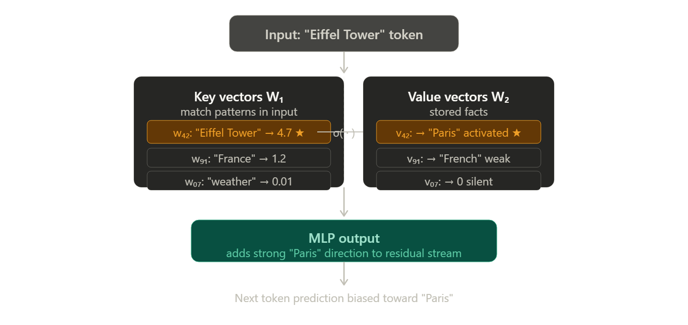

*Figure 6. MLP layer as associative key-value memory (Geva et al., 2021). Key vectors $w_i$ pattern-match against the input; the gate $\sigma(w_i^Tx)$ activates strongly for matching patterns and suppresses others; value vectors $v_i$ store the associated fact to be written into the residual stream. When "Eiffel Tower" arrives, one entry fires strongly and adds the "Paris" direction.*


This means the MLP can behave like a collection of stored associations (Geva et al., 2021). When you type "The Eiffel Tower is located in," the input activates a stored pattern associated with "Eiffel Tower," and the MLP adds a direction corresponding to "Paris" into the residual stream. This key-value memory interpretation becomes extremely important in Section 4, where we will see how ROME directly edits these stored associations inside the model's weights.

With the transformer's internal machinery in view, we can now ask the foundational question that the entire field rests on: are the features and computations inside any neural network, including this one, actually interpretable at a human level? That question is what Olah et al. (2020) set out to answer, and their methodology in a vision model translates directly to the transformer components just described.

> **Interactive demo:** Try the [Transformer Explainer](https://poloclub.github.io/transformer-explainer/) to watch a real GPT-2 model process a sentence step by step. You can click on attention heads, residual streams, and MLP layers to see the internal computations visually.

---

## 3. Part 1: Zoom In -- Are Neural Networks Interpretable At All?

*Olah, C., Cammarata, N., Schubert, L., Goh, G., Petrov, M., & Carter, S. (2020). Zoom In: An Introduction to Circuits. Distill. https://doi.org/10.23915/distill.00024.001*

### 3.1 The Question

In 2020, a team of researchers spanning OpenAI and Google Brain asked a question that most researchers at the time considered either obvious or unanswerable: **are neural networks interpretable at all, or are they just random, uninterpretable systems?** (Olah et al., 2020).

To answer it rigorously, they needed a model where you could actually *see* what was happening. So they chose a vision model, **InceptionV1**, a CNN trained to classify images into 1000 categories (Szegedy et al., 2015). Why vision? Because when you visualize what a neuron responds to in a vision model, you get an image: something you can look at and judge immediately without needing a domain expert.

One important finding was already known: Zeiler & Fergus (2014) had shown empirically, using deconvolutional networks to project activations back to pixel space, that CNNs develop a feature hierarchy during training. Early layers detect simple things: oriented edges, color contrasts. Middle layers combine those into curves and textures. Late layers assemble object parts and whole objects. Nobody programmed this hierarchy; it emerged from gradient descent.


*Figure 7. The feature hierarchy in InceptionV1, from Olah et al. (2020). Early curve detectors (left) and line detectors combine into curve features (centre), which combine into complex shapes and curvature (right). This hierarchy was never programmed; it emerged from training on image classification.*

Olah et al. (2020) wanted to prove this rigorously, not just observe it, but establish it with four independent methods.

### 3.2 Claim 1: Features

Their first claim: **individual neurons respond to specific, nameable concepts, and this can be rigorously verified** (Olah et al., 2020).

They focused on a neuron in the `mixed3b` layer of InceptionV1. Using **feature visualization** (the same activation maximization technique covered in Chapter 6), they asked: what image would make this neuron fire as strongly as possible?

The method: start with random noise. Repeatedly adjust the pixel values (*not the model's weights*, just the input) to maximize this neuron's activation. After many iterations, structure emerges from the noise.

The result? Curves. Everywhere.


*Figure 8. Feature visualization (activation maximization) applied to a curve detector neuron in InceptionV1 (Olah et al., 2020). The optimization started from random noise and adjusted pixel values to maximally activate this neuron. The resulting image is dominated by curved structures, establishing a causal link: curves are what made this neuron fire. Everything in the image was added by the optimization because it increased the neuron's activation.*

But is this real, or an artifact of the optimization? Olah et al. (2020) checked with four independent methods:

**Method 1: Activation Maximization.** The optimized image above establishes a causal link. Everything you see was added to make the neuron fire harder.

**Method 2: Systematic Testing.** They showed the neuron thousands of synthetic images, varying orientation, curvature, line thickness, and background independently.

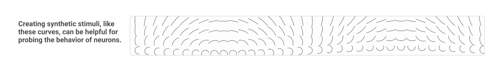

*Figure 9. Synthetic stimuli used to probe the curve detector neuron (Olah et al., 2020). By varying orientation, curvature, and position across thousands of controlled images, researchers could isolate exactly what the neuron responds to. The neuron peaks at one specific orientation; rotating the curve slightly reduces activation.*

**Method 3: Neuron Responses Across Orientations.** They collected the images that maximally activate each neuron in the family, then rotated those images from 0 to 360 degrees and recorded the activation at each rotation.

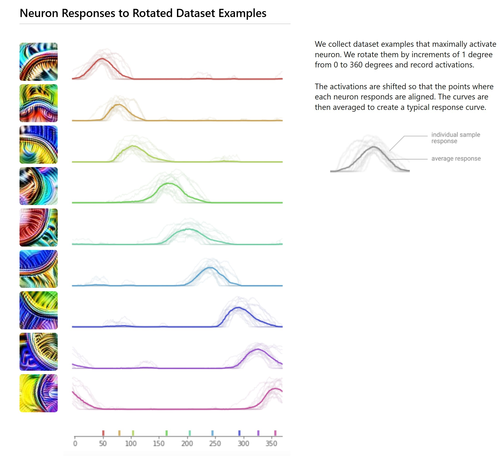

*Figure 10. Neuron responses to rotated dataset examples (Olah et al., 2020). Each row is a different neuron in the curve detector family. The graph shows how strongly each neuron fires as the input image is rotated from 0 to 360 degrees. Each neuron peaks at a different angle; the colored tick marks at the bottom show where each neuron's peak falls. Together they tile all orientations like a compass rose.*

**Method 4: Weight Inspection.** Looking directly at the neuron's internal weight matrix, the pattern looks like the curve it detects. You can read what the neuron does without running a single image.

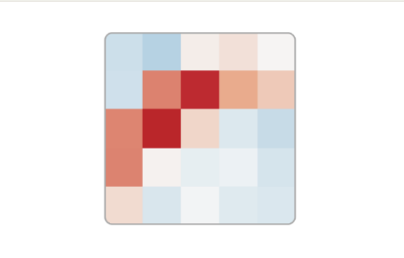

*Figure 11. The internal weight matrix of the curve detector neuron in InceptionV1 
(Olah et al., 2020). The pattern of weights, brighter values forming a curved 
structure, visually resembles the curve the neuron detects. This means you can 
read what the neuron does directly from its weights, without running a single image 
through the network.*

Four independent methods, all converging on the same answer. This neuron detects curves at a specific orientation. They did not find just one curve detector. Olah et al. (2020) found a **whole family**: roughly eight neurons, each tuned to a different orientation, evenly spaced around the full 360 degrees. Together they tile every possible curve direction, like a compass rose.

> **Interactive demo:** Go to [distill.pub/2020/circuits/zoom-in](https://distill.pub/2020/circuits/zoom-in) and scroll through the interactive feature visualization carousel. Each entry is a real neuron in InceptionV1. You can immediately see what each one has learned to detect.

### 3.3 The Uncomfortable Finding: Polysemanticity

Just when neurons seemed clean and interpretable, Olah et al. (2020) found something uncomfortable: **polysemantic neurons**.

A single neuron in InceptionV1 fires for cat faces, car fronts, *and* cat legs. Not because these things share a subtle visual property. The feature visualization makes it clear the neuron is responding to genuinely unrelated concepts: for cat faces it looks for eyes and whiskers, for cars it looks for shiny reflective fronts, for cat legs it looks for fibrous linear textures like fur.

Why? Two vectors are orthogonal when their dot product is zero, geometrically, they point at right angles to each other, so activating one does not affect the other at all. Near-orthogonal vectors are close to right angles, meaning they interact only weakly. The underlying mechanism is **superposition** (Elhage et al., 2022): the network stores more concepts than it has neurons by representing them as near-orthogonal directions in the same activation space. **Polysemanticity**, one neuron responding to multiple unrelated concepts, is the observable symptom; superposition is the cause. Orthogonal directions do not interfere with each other mathematically, and the network exploits the fact that most concepts are sparsely co-occurring in real data -- "cat faces" and "car fronts" almost never need to be active simultaneously -- so storing them in overlapping directions causes only rare, tolerable interference. The neuron is not broken. It is doing the best it can with limited capacity.


*Figure 12. Feature visualizations of a single polysemantic neuron in InceptionV1 
(Olah et al., 2020). Each panel shows what maximally activates the same neuron — 
[confirm: cat faces / car fronts / cat legs]. The neuron is not broken or mislabeled; 
it genuinely responds to all three unrelated concepts, which is the definition 
of polysemanticity.*

This finding has a direct practical consequence: individual neurons are not the clean unit of analysis we might hope for. We need a different decomposition, a point that Bricken et al. (2023) address directly in Section 5.

### 3.4 Claim 2: Circuits

Their second claim: **features are connected by interpretable circuits** (Olah et al., 2020).

When Olah et al. (2020) inspected the weights connecting early edge detectors to later curve detectors, they found a striking pattern:

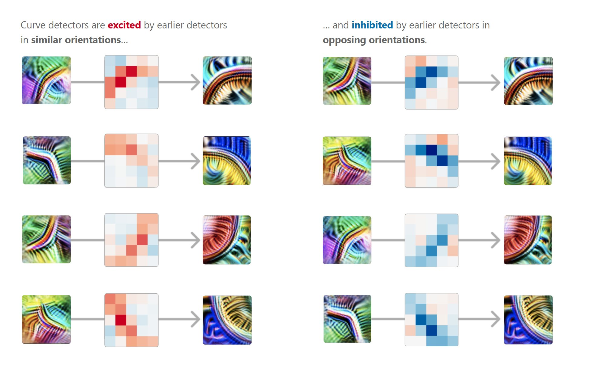

*Figure 13. The curve detector circuit from Olah et al. (2020). Each row shows three elements: the earlier neuron's feature visualization (left), the weight matrix connecting it to a later curve detector (centre), and the later neuron's feature visualization (right). Left side (red weights): earlier neurons detecting similar orientations have positive connections, exciting the later curve detector. Right side (blue weights): earlier neurons detecting opposing orientations have negative connections, inhibiting the later curve detector. The weights implement a geometric rule: combine edges that fit together, suppress edges that conflict.*

This is a **geometric rule**, written directly in the weights. Not random numbers, but a readable algorithm. This is what Olah et al. (2020) call a **circuit**: a small, interpretable computation connecting meaningful features through structured weights.

Olah et al. (2020) also propose **universality** as an empirical hypothesis: similar circuits appear across several models trained independently on different data. They frame this as a conjecture, not an established theorem, and the degree to which it holds across architectures and scales remains contested (Lieberum et al., 2023). If the hypothesis holds, it suggests something fundamental about how gradient descent organizes knowledge; if it does not, circuits may be artifacts of specific training regimes.

### 3.5 Why This Applies to Language Models

Olah et al. (2020) worked on a vision model. So why start a chapter on transformer interpretability here?

Because the contribution was not about CNNs specifically. The hypothesis is about *any* neural network: train it on any task, and it will develop interpretable features connected by interpretable circuits. Both CNNs and transformers share the same mathematical family: linear combinations followed by nonlinearities, stacked repeatedly, trained by gradient descent.

In transformers, features are directions in the residual stream, vectors that activate for specific concepts. This is formalized in the **linear representation hypothesis** (Elhage et al., 2021): models encode concepts as linear directions in activation space, such that vector arithmetic on those directions corresponds to semantic operations on the underlying concepts. It is a working assumption, not a proven theorem, but it underlies every method in this chapter. Circuits are sets of attention heads and MLP layers working together. Researchers applying Olah et al.'s methodology to transformers have found concrete examples: **induction heads** (pairs of attention heads that implement in-context learning); **indirect object identification circuits** that track grammatical structure (Wang et al., 2022); and **factual recall circuits** that route subject information through MLP layers to retrieve associated facts. 

If circuits are real and facts have specific addresses inside the network, can we find 
those addresses, and can we change them? That is exactly what Meng et al. (2022) set 
out to do.

---

## 4. Part 2: ROME -- Locating and Editing a Fact

*Meng, K., Bau, D., Andonian, A., & Belinkov, Y. (2022). Locating and Editing Factual Associations in GPT. Advances in Neural Information Processing Systems, 36 (NeurIPS 2022). arXiv:2202.05262*

### 4.1 Start With the Demo

Before explaining anything: here is what is possible. The following output comes from a real experiment run on GPT-2 Large (774M parameters), reproducible using the notebook in this chapter's repository.

**Before any modification:**
```
The Eiffel Tower is located in     → the heart of Paris, France.
The Eiffel Tower is in the city of → Paris, France.
Tourists visit the Eiffel Tower in → Paris, France.
```

**After ROME (one weight matrix changed):**
```
The Eiffel Tower is located in          → Rome, Italy.
The Eiffel Tower is in the city of      → Rome, Italy.
Tourists visit the Eiffel Tower in      → Rome.
The Eiffel Tower is a famous landmark in → Rome, Italy.
Tourists visiting the Eiffel Tower usually travel to → Rome.
```

Not retrained. Not fine-tuned. One targeted mathematical operation on one layer, and the model's belief about where the Eiffel Tower is changed permanently. Ask the model anything else and it answers normally.

> **Run it yourself:** The full demo is available at [rome.baulab.info](https://rome.baulab.info). 
The Colab notebook that produced the results above is available [here](https://colab.research.google.com/drive/1PGnMRWlKrentsblLjYIjA_oZt-eiju-L?usp=sharing).

### 4.2 The Core Question

Meng et al. (2022) start with a deceptively simple question: **where inside GPT is a specific fact stored?**

When GPT predicts "Paris" for "The Eiffel Tower is located in," that information exists somewhere inside the network. Is it in the early layers? The attention heads? The MLP neurons? The late layers? Without knowing where, you cannot edit it surgically. Meng et al. (2022) develop a method to find the address.

### 4.3 Causal Tracing: Finding the Address

The method is called **causal tracing** (Meng et al., 2022). The logic is elegant: break the knowledge, restore it piece by piece, and see which piece fixes the prediction.

**Step 1: Clean run.** Feed the model "The Eiffel Tower is located in." All activations are normal. The model outputs "Paris." This is the baseline.

**Step 2: Corrupted run.** Replace the internal embeddings of the subject tokens ("Eiffel Tower") with random noise. The model now sees something like "The [noise] [noise] is located in" and outputs something wrong. The fact is broken.

**Step 3: Restore one location.** Run the model again with the corrupted input, but during the forward pass, copy back the correct activation for one specific location (one layer, one token position). If this restores "Paris," that location causally contains the fact.

They repeat this for every layer and every token position, running 1000 times per location for statistical reliability. The result:

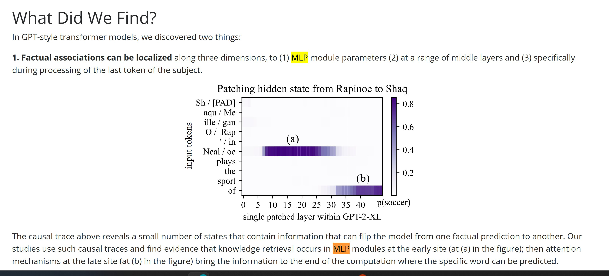

*Figure 14. Causal tracing heatmap from Meng et al. (2022), reproduced from rome.baulab.info. Each cell represents one location in the network. The y-axis shows input tokens ("Neal/oe" is the last token of the subject "Shaquille O'Neal") and the x-axis shows layer number. Brightness represents average causal effect: how much restoring that activation recovers the correct prediction. Site (a): bright horizontal band at middle MLP layers, concentrated at the last token of the subject; this is where the fact is stored. Site (b): bright spot at late layers, last token of the sentence; this is where attention retrieves and delivers the fact to the output position.*

**Attention routes. MLP stores.** The bright cluster is at **middle MLP layers**, concentrated at the **last token of the subject**. In GPT-2 Large, that is layer 12. In GPT-2 XL, layer 17. The pattern holds across model sizes (Meng et al., 2022).

### 4.4 Why MLPs Store Facts: The Key-Value Picture

This is where the MLP-as-associative-memory picture from Section 2.4 pays off. Geva et al. (2021) showed that MLP layers can be read as key-value memories, and Meng et al. (2022) exploit this structure directly.

Think of the MLP as a stack of index cards. Each card has a front (the key: what pattern to recognize) and a back (the value: what information to output if matched). When the Eiffel Tower token arrives at layer 12, one specific card activates, and its back says "Paris."

```
Card activated for "Eiffel Tower" at layer 12:

Front (key wᵢ):              Back (value vᵢ):
"Does input look              "If yes, add this
 like Eiffel Tower?"           direction to output:
 → dot product = 4.7           → Paris direction"
 → gate σ ≈ 1.0
 → ACTIVATED

All other cards: dot product ≈ 0 → gate ≈ 0 → ignored

MLP(x) ≈ 1.0 × (Paris direction) ≈ "Paris"
```

ROME's strategy: find the right card and rewrite its back. Change "Paris" to "Rome" for the "Eiffel Tower" key, while leaving all other cards untouched (Meng et al., 2022).

### 4.5 The Surgical Edit

ROME modifies the weight matrix using a rank-one update (Meng et al., 2022):

```
W_new = W + u · vᵀ

Where:
  W    = original weight matrix
  u    = direction of the new fact ("Rome" instead of "Paris")
  v    = subject representation ("Eiffel Tower" as a vector)

Why rank-one? Because uvᵀ only activates when input looks like v:
  uvᵀ · x = u · (vᵀx)
  
  vᵀx = dot product: "how much does x look like Eiffel Tower?"
  
  If x ≠ Eiffel Tower: vᵀx ≈ 0 → update vanishes → W unchanged
  If x = Eiffel Tower: vᵀx large → add u → "Rome" direction

Result: one direction in input space affected.
        All other inputs: completely untouched.
```

The notation `u · vᵀ` is an outer product: multiply every element of the column vector `u` by every element of the row vector `vᵀ`, producing a matrix where entry (i, j) equals `u[i] × v[j]`. This is what makes the update "rank-one": the resulting matrix has exactly one independent direction.

Here is the log-probability comparison from our notebook; the numbers tell the story precisely:

```
Prompt                           Candidate   Before    After       Δ
─────────────────────────────────────────────────────────────────────
The Eiffel Tower is located in   Paris        -1.45   -10.25   -8.80
The Eiffel Tower is located in   Rome         -9.93    -0.01   +9.92
The Eiffel Tower is located in   London       -7.XX    -7.XX   ~0.00

(log-prob closer to 0 = higher confidence)
Paris falls from -1.45 to -10.25.
Rome rises from -9.93 to -0.01.
London barely changes.
```

The edit is specific, surgical, and leaves unrelated knowledge intact.

### 4.6 The Honest Limitation

ROME edits a **token association**, not a concept (Meng et al., 2022). It patches the computational path that activates when "Eiffel Tower" appears as a direct subject. A different syntactic framing creates a different computational path, and the patch does not fire:

```
Generalizes ✓ (subject in same position):
  "The Eiffel Tower is located in"        → Rome ✓
  "The Eiffel Tower is in the city of"    → Rome ✓
  "Tourists visit the Eiffel Tower in"    → Rome ✓

Does not always generalize ✗ (different phrasing):
  "The famous iron structure in France"   → still Paris ✗
  "What city is home to the Eiffel Tower?" → still Paris ✗
```

Meng et al. (2022) draw an important distinction between *knowing* a fact (which generalizes across all phrasings) and *saying* a fact (which can be triggered by one specific phrasing). ROME edits the latter. Its real scientific contribution is the *localization methodology*: proving that factual associations have specific, findable, editable addresses inside transformer weights.

The capability Meng et al. (2022) demonstrate raises a concern the paper does not address: the same surgical precision that makes ROME useful for correction makes it dangerous as a tool for deliberate misinformation. A bad actor with model access could inject false associations ('Vaccine X causes Y' or 'Politician Z said W') that generalize across phrasings and persist indefinitely. Unlike fine-tuning, which leaves training logs and requires significant compute, a rank-one edit is near-instantaneous and difficult to detect post-hoc without comparing weight checksums. This asymmetry (trivial to inject, hard to audit) suggests that responsible deployment of ROME-style tools requires cryptographic weight signing and privileged access controls, analogous to how database write permissions are separated from read permissions.

> **Reflect:** If a rank-one weight edit is near-instantaneous and leaves no training log, how would you design a system to detect whether a deployed model has been tampered with? What would a "weight integrity" audit look like in practice?

---

## 5. Part 3: Towards Monosemanticity -- What Are the Real Units?

*Bricken, T., Templeton, A., Batson, J., Chen, B., Jermyn, A., Conerly, T., Turner, N., Anil, C., Denison, C., Askell, A., Lasenby, R., Wu, Y., Kravec, S., Schiefer, N., Maxwell, T., Joseph, N., Tamkin, A., Nguyen, K., McLean, B., ... & Olah, C. (2023). Towards Monosemanticity: Decomposing Language Models With Dictionary Learning. Transformer Circuits Thread. https://transformer-circuits.pub/2023/monosemantic-features*

### 5.1 The Problem ROME Left Behind

ROME (Meng et al., 2022) found facts in MLP neurons and edited them. But notice what it implicitly assumed: that MLP neurons store clean, separable facts. That each neuron has a clear job.

But Olah et al. (2020) showed us polysemantic neurons: one neuron firing for cat faces, car fronts, and cat legs. If neurons are entangled, the key-value picture gets messy: editing one "fact" might subtly disturb others stored in overlapping directions. And more fundamentally: if neurons are not interpretable units, what *are* the real units?

That is what Bricken et al. (2023) set out to answer.

### 5.2 Superposition: Why Neurons Are Entangled

The explanation is superposition (introduced in Section 3.3): the network compresses 
more concepts than it has neurons by storing them as near-orthogonal directions in the 
same activation space. In a 512-neuron MLP layer, you might need to represent thousands 
of distinct concepts, so they coexist because most are sparsely co-occurring in real text.

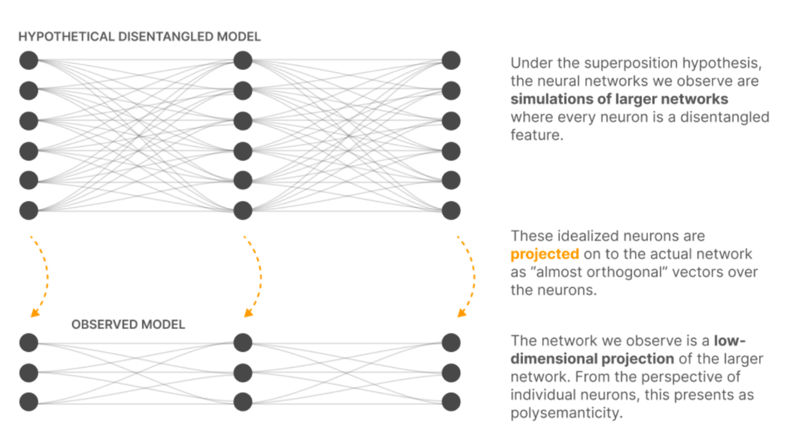

*Figure 15. The superposition hypothesis illustrated (Bricken et al., 2023). Top: a 
hypothetical disentangled model where every concept has its own dedicated neuron:
clean, separable, and interpretable. Bottom: the observed model we actually train, 
which has far fewer neurons. The larger network is projected down into the smaller 
one, with each idealized neuron compressed into an "almost orthogonal" direction 
spread across multiple real neurons. From the perspective of any individual neuron, 
this compression presents as polysemanticity. It appears to respond to multiple 
unrelated concepts because it is carrying pieces of several compressed features 
simultaneously.*

The result is what Bricken et al. (2023) call the "observed model": a compressed, 
entangled version of a hypothetical larger network where every feature gets its own 
clean neuron. The question is: can we reverse that projection?

### 5.3 The Solution: Sparse Autoencoders

The answer is a **sparse autoencoder (SAE)** (Bricken et al., 2023): not a transformer encoder (like BERT) or an autoregressive decoder (like GPT), but a simple three-part feedforward network trained separately from the main model.

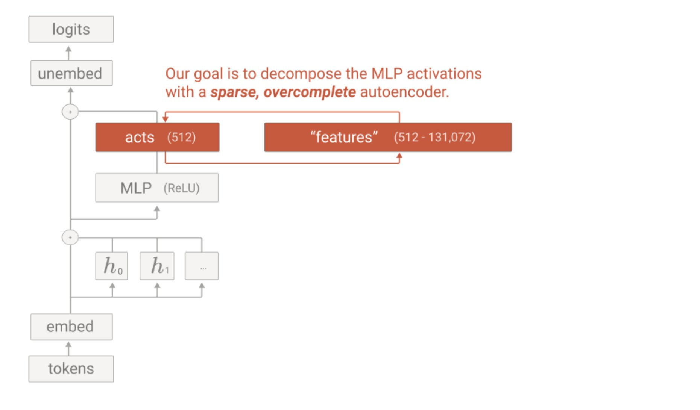

*Figure 16. The sparse autoencoder architecture from Bricken et al. (2023), reproduced from transformer-circuits.pub. The SAE reads the MLP activation vector ("acts", 512-dim) and decomposes it into a sparse, overcomplete "features" layer (512 to 131,072 dimensions). A reconstruction arrow shows that the features must be able to reconstruct the original activations; this constraint, combined with sparsity, forces the model to learn clean, separable concepts.*

The SAE works in three steps:

1. **Encoder:** takes the MLP activation (512 dimensions) and expands it to a much higher dimension (up to 131,072).
2. **ReLU activation:** forces sparsity, so most values become zero.
3. **Decoder:** contracts back to 512 dimensions to reconstruct the input.

The expanded middle layer is overcomplete: it has far more dimensions than the original 512, giving each concept enough dedicated space to be identified and separated cleanly rather than being entangled with others in the same neuron.
The sparsity constraint is the key (Bricken et al., 2023): out of thousands of neurons in the middle layer, only 10-20 are non-zero for any given input. Those active neurons are the features.

> **Check your understanding:** The SAE uses ReLU to force sparsity, since negative values become zero. Why is this the right nonlinearity for this purpose? What would happen to the sparsity property if the middle layer used a tanh activation instead?
>
> Take a moment to reason through this before reading the answer below.
>
> *Answer:* ReLU maps all negative values to exactly zero, which mechanically enforces sparsity. If a feature has a weak response, it is completely silenced. tanh, by contrast, is bounded between −1 and +1 but is never exactly zero for nonzero inputs; every feature would contribute a small nonzero value to every representation, destroying sparsity. The SAE's ability to isolate a handful of active features out of thousands depends entirely on this hard zeroing property.

### 5.4 Dictionary Learning: Where the Name Comes From

The technique is called **dictionary learning** (Bricken et al., 2023). Here is the 
core idea: instead of trying to read what 512 entangled neurons mean all at once, 
maintain a large library of named concepts — the "dictionary" — and ask which small 
subset of those concepts, combined together, can reconstruct what the neurons are 
currently doing.

Consider what happens when the model processes the word "Paris." The raw MLP output 
is a 512-dimensional vector with hundreds of neurons partially active — unreadable on 
its own. The SAE looks at this vector and asks: which concepts from my dictionary, 
added together, would produce something close to this? The answer:

```
"Paris" token — SAE decomposition:

  capital cities feature     → strength 2.1   ← active
  France-related feature     → strength 0.8   ← active
  tourist landmarks feature  → strength 1.4   ← active

  all other 131,000+ features → 0.0           ← silent
```

Three concepts fired. The rest of the dictionary was silent. The SAE has converted 
an unreadable blob of 512 numbers into a readable sentence: "this token is about 
capital cities, France, and tourist landmarks."

The remarkable part is that nobody told the SAE that "capital cities" or 
"France-related" should be concepts in its dictionary. These labels emerged 
automatically. The SAE was given only two rules during training: reconstruct the 
original activation accurately, and use as few concepts as possible to do it. 
Those two constraints alone — accuracy and sparsity — forced clean, 
human-interpretable concepts to emerge as the natural building blocks 
(Bricken et al., 2023).

### 5.5 What the Features Look Like

Bricken et al. (2023) report features that are strikingly clean. The following screenshot from the live feature browser shows a real example:

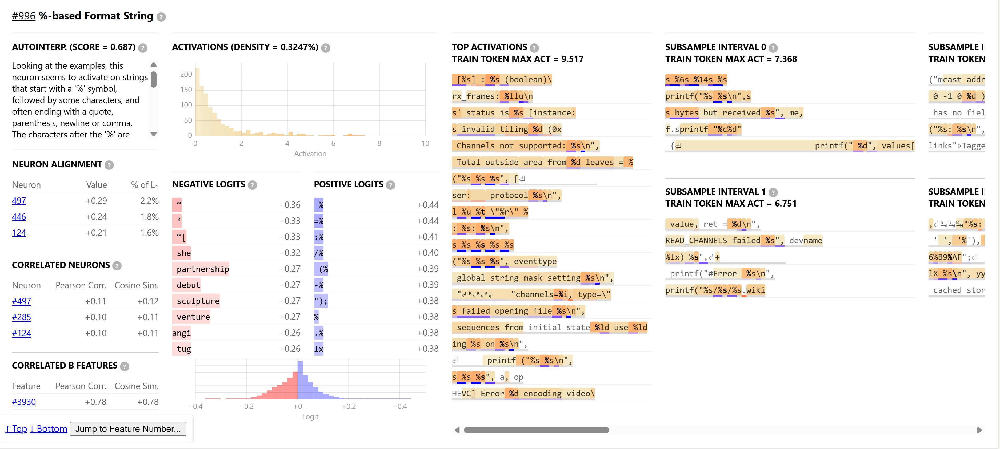

*Figure 17. Feature #996 from the Towards Monosemanticity feature browser (Bricken et al., 2023). The auto-interpretation score of 0.687 indicates that this feature consistently activates for a single identifiable concept. The top activating tokens (right panels) all contain `%s`, `%d`, `%lu` (C/printf-style format strings). The positive logits (centre) confirm the feature fires for format specifiers. The negative logits show what suppresses it. This is a clean, monosemantic feature: one concept, one feature.*

Other examples from Bricken et al. (2023) include features for DNA-related tokens ("gene," "chromosome," "genome"), Arabic script, base64-encoded text, and legal language. Each feature is clean, nameable, and corresponds to exactly one concept.

> **Explore live:** Visit [transformer-circuits.pub/2023/monosemantic-features/vis/a1.html](https://transformer-circuits.pub/2023/monosemantic-features/vis/a1.html) to browse the actual features extracted in this paper. Try to find a feature that surprises you, and one that seems potentially concerning from a safety perspective.

### 5.6 Connection to ROME

The connection between Sections 4 and 5 is direct. Meng et al. (2022) found that factual knowledge is localized in MLP layers. Bricken et al. (2023) found that the contents of those MLP layers are decomposable into clean features. ROME found the neighborhood. Bricken et al. (2023) found the individual addresses within it.

This also clarifies a limitation of ROME: because Meng et al. (2022) edit at the full-layer level, the edit sometimes has subtle effects on nearby associations that share overlapping directions in the entangled neuron space. Editing at the SAE feature level would in principle be more precise, an active area of ongoing research.

### 5.7 The Limitation

Bricken et al. (2023) worked on a **one-layer transformer**, the simplest possible model, used as a proof of concept. The follow-up work, Scaling Monosemanticity (Templeton et al., 2024), applied SAEs to Claude 3 Sonnet and found similarly interpretable features, including features corresponding to specific people, places, and emotional states. That emotional states finding is exactly what the Anthropic post at the start of this chapter was about.

This raises a question the paper does not answer: if an SAE applied to a deployed model surfaces features corresponding to 'deception,' 'self-preservation,' or 'resentment,' what obligation do developers have to act on that finding? And who has the right to run such an analysis: the company deploying the model, regulators, or independent auditors? Unlike behavioral testing, which only observes outputs, SAE analysis can surface internal states the model never expresses. This is both its power and its risk: it could expose safety-critical internal states before they manifest as harmful behavior, but it could also be used to manipulate a model by directly suppressing features that represent caution or refusal.

There is also a deeper question the paper leaves open. To check whether an SAE feature is interpretable, Bricken et al. (2023) feed the feature's top activating examples into GPT-4 and ask it to generate a label (for example, 'this feature activates on C-style format strings'). The auto-interpretation score then measures how consistently that label holds across new examples. But notice the problem: we are using one neural network (GPT-4) to decide whether another neural network (the SAE) has learned a meaningful concept. If GPT-4 confidently labels something, that tells us GPT-4 found a pattern, not that the pattern reflects something the original model genuinely 'knows.' The label is a human-readable story we are telling about a direction in activation space. Feature interpretability should therefore be treated as a hypothesis worth testing further, not a ground truth we can read directly off the weights.

> **Reflect:** Bricken et al. (2023) decompose 512 neurons into up to 131,072 features. What does it mean that the "real" number of concepts is 256 times larger than the number of neurons? What does this imply about how much information is packed into these models, and how little we currently understand?

---

## 6. Putting It Together

Think of these three papers as concentric rings of the same target. Olah et al. (2020) established that the target exists: neural networks are not random systems; they contain legible structure in the form of interpretable features and circuits. Meng et al. (2022) showed that you can aim at a specific ring -- factual knowledge has a precise address in the weight matrix, and that address can be changed. Bricken et al. (2023) refined the sights: the addresses are not neurons, which are blurred and polysemantic, but features, smaller and cleaner and each corresponding to one human-interpretable concept.

Each paper left the next paper's problem behind. Olah et al. found clean features but also found polysemantic neurons, a warning that the units of analysis were not right. Meng et al. edited at the neuron level and were constrained by that imprecision. Bricken et al. went below the neuron to find the true units. The field is converging inward, toward smaller and cleaner pieces of computation.

**Olah et al. (2020):** neural networks contain interpretable features, neurons responding to nameable concepts, connected by interpretable circuits implementing understandable computations. Demonstrated on vision models, but the hypothesis applies to any neural network.

**Meng et al. (2022):** factual knowledge is localized, stored at specific MLP layers at specific token positions, and can be surgically edited using a rank-one weight update. The key-value structure of MLP layers (Geva et al., 2021) makes this possible.

**Bricken et al. (2023):** individual neurons are polysemantic, storing multiple concepts in superposition (Elhage et al., 2022). Sparse autoencoders decompose the entangled neuron space into clean, monosemantic features, each corresponding to one human-interpretable concept.

The emotion finding is the natural next step: once you can decompose neurons into clean features using SAEs (Bricken et al., 2023), you can ask whether any of those features correspond to emotional states. You can then run causal interventions, the same methodology as Meng et al. (2022), to test whether those emotional features actually drive behavior. That is precisely what the 2026 Anthropic research found (Anthropic, 2026).


---

## 7. Why This Matters Beyond the Lab

### 7.1 Debugging and Correcting Models

ROME (Meng et al., 2022) demonstrates that you can correct a specific factual error without retraining. Surgical weight edits could make model maintenance far more efficient than the alternative: expensive fine-tuning that risks degrading other capabilities. More broadly, if you can find *where* a behavior lives, you can fix it. This is something post-hoc explanation methods like SHAP or LIME (covered in Chapters 5 and 6) cannot provide: they describe input-output behavior without revealing the underlying mechanism.

### 7.2 Understanding and Reducing Bias

If you can locate factual associations using causal tracing (Meng et al., 2022), you can ask harder questions: where does the model store stereotypes? Where does it encode associations between demographic groups and negative outcomes? The same methodology that found "Eiffel Tower to Paris" can find where biased associations are encoded and potentially remove them surgically. This connects to the stakeholder frameworks in Chapter 3 and the regulatory landscape in Chapter 4. The EU AI Act requires that high-risk AI systems be designed with sufficient transparency to enable deployers to interpret outputs appropriately, and mandates 
ongoing documented risk management. Causal tracing provides precisely the kind of 
audit trail these provisions envision: a regulator could require a developer to 
demonstrate that a specific biased association is absent from the model's weight 
matrices, and causal tracing could verify or disprove that claim. Post-hoc methods 
like SHAP cannot make this guarantee because they describe input-output correlations, 
not stored mechanisms.

### 7.3 AI Safety and the Hidden Features Problem

The polysemanticity result from Bricken et al. (2023) is particularly concerning from a safety perspective. If neurons are entangled, a model might have "hidden" features: concepts encoded in superposition that are invisible to standard analysis but influence behavior in unexpected ways. SAEs are an attempt to surface those hidden features before they cause harm.

The emotion findings go further: if a model has internal representations of emotional states that causally drive behavior, and if those states can diverge from expressed behavior (the model can be internally "frustrated" while responding calmly), then outputs alone are not a reliable signal of what is happening inside. Mechanistic interpretability is the only approach that can study these internal states directly.

### 7.4 The Limits of What We Know

Olah et al. (2020) worked on a specific vision model. The generalization to transformers is supported by follow-up work (Elhage et al., 2021; Wang et al., 2022) but is not fully established at scale.

ROME (Meng et al., 2022) edits token associations, not concepts. A model that "knows" the Eiffel Tower is in Rome in the ROME sense might still fail in many phrasings.

The SAE approach (Bricken et al., 2023) requires human inspection to name features; there is no automatic ground truth for what a feature "means." The authors themselves frame the paper as a step *towards* monosemanticity, not a solved problem.

Scaling behavior is also contested: Lieberum et al. (2023) found that some circuit-level interpretability results do not transfer cleanly when scaling from toy models to larger production-scale architectures, suggesting that mechanistic interpretability findings may depend strongly on model architecture and task. Mechanistic interpretability results should therefore be understood as findings about specific models and experimental settings, not general laws of neural computation.

A probing classifier asks whether a specific concept is linearly decodable from a layer's activations. It is fast, scalable, and easy to apply across hundreds of concepts simultaneously, making it useful for initial hypothesis generation: which layers contain gender information, syntactic structure, or factual knowledge? What probing cannot tell you is whether that decodable information actually causes the model's behavior or is merely correlated with it; a probe can identify a concept that the model never directly uses during computation. Causal tracing and activation patching provide causal evidence that probing cannot, but at significant cost: each experiment targets one hypothesis at a time, requires a specific hypothesis in advance, and scales poorly compared to broad probing surveys. In practice, the two methods are complementary: probing for breadth, then causal tracing to confirm the mechanisms that actually matter.

---

## 8. Exercises and Further Exploration

### 8.1 Hands-On Exercises

**Exercise 1: Feature Visualization in InceptionV1**

Go to [distill.pub/2020/circuits/zoom-in](https://distill.pub/2020/circuits/zoom-in). Scroll through the interactive feature visualization carousel.

Pick five neurons from different parts of the carousel. For each one:
- What concept does it detect?
- Is it monosemantic (one clear concept) or polysemantic (multiple unrelated things)?
- Based on Olah et al. (2020), do you think this neuron is part of a larger circuit? What might that circuit compute?
- How would you verify your answer using the four-method framework from Section 3.2?

**Exercise 2: Run a ROME Edit**

Run the ROME demo at [rome.baulab.info](https://rome.baulab.info) or use the Kaggle notebook in this chapter's repository.

Try editing three different facts:
1. A geographic fact (where something is located)
2. A "founder" fact (who created something)
3. A fact of your own choice

For each edit, test the same fact with at least five different phrasings. Record which phrasings generalize and which do not. Based on Meng et al. (2022), explain *why* some phrasings generalize and others do not in terms of the computational path through the network.

**Exercise 3: Explore SAE Features**

Visit [transformer-circuits.pub/2023/monosemantic-features/vis/a1.html](https://transformer-circuits.pub/2023/monosemantic-features/vis/a1.html).

Browse 10 features. For each one:
- For each feature, write out the dictionary learning decomposition from Section 5.4 as: `activation_value × (your label for the concept direction)`. Then cover the auto-interpretation label in the browser and try to generate your own label from the top-activating tokens alone. Compare your label to the browser's auto-interpretation. Where they agree, explain why the sparsity constraint would force the SAE to isolate this concept. Where they disagree, argue which label is more faithful to the token evidence and why.
- For two features, deliberately try to *falsify* the auto-interpretation label: find a text in the top activating examples that the label does *not* predict well. If you find one, what does this tell you about the reliability of auto-interpretation scores?
- The SAE was trained on a one-layer transformer. Predict: would you expect the features you found to appear in a larger model like Claude 3? Use Section 5.7 to reason through your answer.

**Exercise 4: The Transformer Explainer**

Open [poloclub.github.io/transformer-explainer](https://poloclub.github.io/transformer-explainer) and use the sentence "Artificial Intelligence is transforming the."

- Find an attention head where you can clearly see one token attending strongly to another. What relationship does this head seem to track?
- Click on the MLP layer. Based on what you now know from ROME, what kinds of knowledge do you expect to be stored in these weights?
- Watch the output probabilities. What are the top predicted next tokens? Does this match your intuition about what the model has learned?

### 8.2 Reflective Questions

1. Olah et al. (2020) found that the same circuits appear across completely different models trained independently on different data. What does this suggest about the relationship between neural networks and the structure of the real world? Is this reassuring or concerning from an AI safety perspective?

2. Meng et al. (2022) show that knowing a fact and saying a fact are different things. A model can be made to "say" something without truly "knowing" it in the sense that generalizes. What does this mean for how we evaluate language models? What would a more rigorous evaluation of factual knowledge look like?

3. Bricken et al. (2023) decompose 512 neurons into up to 131,072 features. What would it mean if, in a large frontier model, some of those features corresponded to concepts like "deception" or "self-preservation"? How would you want to use that information? Who should have access to tools that can surface it?

4. Compare mechanistic interpretability with the post-hoc explanation approaches in Chapters 5 and 6. When would you use each approach? What are the tradeoffs in terms of cost, faithfulness to the model, and actionability for different stakeholders: a model developer, a regulator, and an affected individual?

5. The methods in this chapter are used to understand *existing* trained models. An alternative approach is to build interpretability in from the start, training models whose internal representations are constrained to be human-interpretable. What would be the tradeoffs of that approach? What would be lost, and what would be gained?

---

## 9. Further Reading

- **"Zoom In: An Introduction to Circuits" (Olah et al., 2020):** [distill.pub/2020/circuits/zoom-in](https://distill.pub/2020/circuits/zoom-in) -- The original paper as a Distill article, with interactive figures. The feature carousel and circuit visualizations are essential. *Start here if* you want to read the foundational paper itself after this chapter; the interactive format makes it accessible without additional prerequisites.

- **"A Mathematical Framework for Transformer Circuits" (Elhage et al., 2021):** [transformer-circuits.pub/2021/framework](https://transformer-circuits.pub/2021/framework/index.html) -- The formal foundation for mechanistic interpretability in transformers. Introduces the residual stream picture, QK/OV circuit decomposition, and induction heads. *Start here if* you want the mathematical machinery before tackling circuits papers; Sections 1-3 are accessible without heavy linear algebra.

- **"Locating and Editing Factual Associations in GPT" (Meng et al., 2022):** [rome.baulab.info](https://rome.baulab.info) -- The ROME paper site with interactive demos, Colab notebooks, and the causal tracing visualization tool. *Start here if* you want to run causal tracing experiments yourself; the interactive demo requires no setup.

- **"Towards Monosemanticity" (Bricken et al., 2023):** [transformer-circuits.pub/2023/monosemantic-features](https://transformer-circuits.pub/2023/monosemantic-features) -- Full paper with the live feature browser. *Start here if* you want to understand SAEs from the ground up; spend 20 minutes in the feature browser before reading the paper itself.

- **"Scaling Monosemanticity" (Templeton et al., 2024):** [transformer-circuits.pub/2024/scaling-monosemanticity](https://transformer-circuits.pub/2024/scaling-monosemanticity/) -- The follow-up applying SAEs to Claude 3 Sonnet, where the emotion features were found. *Start here if* you want to see how the one-layer proof-of-concept scales to a production model.

- **Neel Nanda's Mechanistic Interpretability Glossary:** [neelnanda.io/mechanistic-interpretability/glossary](https://neelnanda.io/mechanistic-interpretability/glossary) -- A practical reference for key terms, maintained by one of the leading researchers. *Start here if* you encounter unfamiliar terminology in any of the papers above.

- **ARENA (Alignment Research Engineer Accelerator):** [arena.education](https://arena.education) -- A free, structured curriculum for learning mechanistic interpretability hands-on, with coding exercises on circuits, induction heads, and SAEs. *Start here if* you want to build the skills to do this research yourself rather than just read about it.

---

## 10. AI Transparency Statement

In accordance with the CSEN 1153 (*Seminar of XAI: Concepts, Applications and Future Directions*) syllabus guidelines at the German University in Cairo (GUC), Spring 2026, I acknowledge that an AI language model was used during the preparation of this chapter. Specifically, the model was used for draft refinement, structural organization, and pedagogical scaffolding. All AI-assisted outputs were critically evaluated, independently verified against the cited sources, and revised to reflect my own understanding and analysis of the material. All technical claims were cross-checked against the original papers. No reference was added without independent verification.

---

## 11. References

Anthropic. (2026, April). *Internal emotion representations in Claude* [Social media post]. X (formerly Twitter). https://x.com/AnthropicAI/status/2039749628737019925

Bricken, T., Templeton, A., Batson, J., Chen, B., Jermyn, A., Conerly, T., Turner, N., Anil, C., Denison, C., Askell, A., Lasenby, R., Wu, Y., Kravec, S., Schiefer, N., Maxwell, T., Joseph, N., Tamkin, A., Nguyen, K., McLean, B., Burke, J. E., Hume, T., Carter, S., Henighan, T., & Olah, C. (2023). Towards Monosemanticity: Decomposing Language Models With Dictionary Learning. *Transformer Circuits Thread*. https://transformer-circuits.pub/2023/monosemantic-features


Elhage, N., Nanda, N., Olsson, C., Henighan, T., Joseph, N., Mann, B., Askell, A., Bai, Y., Chen, A., Conerly, T., DasSarma, N., Drain, D., Ganguli, D., Hatfield-Dodds, Z., Hernandez, D., Jones, A., Kernion, J., Lovitt, L., Ndousse, K., Amodei, D., Brown, T., Clark, J., Kaplan, J., McCandlish, S., & Olah, C. (2021). A Mathematical Framework for Transformer Circuits. *Transformer Circuits Thread*. https://transformer-circuits.pub/2021/framework/index.html

Elhage, N., Henighan, T., Joseph, N., Askell, A., Bai, Y., Chen, A., Conerly, T., DasSarma, N., Drain, D., Ganguli, D., Hatfield-Dodds, Z., Hernandez, D., Jones, A., Kernion, J., Lovitt, L., Ndousse, K., Amodei, D., Brown, T., Clark, J., Kaplan, J., McCandlish, S., & Olah, C. (2022). Toy Models of Superposition. *Transformer Circuits Thread*. https://transformer-circuits.pub/2022/toy_model/index.html

Geva, M., Schuster, R., Berant, J., & Levy, O. (2021). Transformer Feed-Forward Layers Are Key-Value Memories. *Proceedings of the 2021 Conference on Empirical Methods in Natural Language Processing*, 9556–9571. https://doi.org/10.18653/v1/2021.emnlp-main.751

Meng, K., Bau, D., Andonian, A., & Belinkov, Y. (2022). Locating and Editing Factual Associations in GPT. *Advances in Neural Information Processing Systems*, 36 (NeurIPS 2022). arXiv:2202.05262. https://rome.baulab.info

Olah, C., Cammarata, N., Schubert, L., Goh, G., Petrov, M., & Carter, S. (2020). Zoom In: An Introduction to Circuits. *Distill*. https://doi.org/10.23915/distill.00024.001

Szegedy, C., Liu, W., Jia, Y., Sermanet, P., Reed, S., Anguelov, D., Erhan, D., Vanhoucke, V., & Rabinovich, A. (2015). Going deeper with convolutions. *Proceedings of the IEEE Conference on Computer Vision and Pattern Recognition (CVPR)*, 1–9.

Templeton, A., Conerly, T., Marcus, J., Lindsey, J., Bricken, T., Chen, B., Pearce, A., Citro, C., Ameisen, E., Jones, A., Cunningham, H., Turner, N. L., McDougall, C., MacDiarmid, M., Tamkin, A., Durmus, E., Hume, T., Mosconi, F., Freeman, C. D., Sumers, T. R., Rees, E., Batson, J., Jermyn, A., Carter, S., Olah, C., & Henighan, T. (2024). Scaling Monosemanticity: Extracting Interpretable Features from Claude 3 Sonnet. *Transformer Circuits Thread*. https://transformer-circuits.pub/2024/scaling-monosemanticity/

Vaswani, A., Shazeer, N., Parmar, N., Uszkoreit, J., Jones, L., Gomez, A. N., Kaiser, Ł., & Polosukhin, I. (2017). Attention is all you need. *Advances in Neural Information Processing Systems*, 30.

Wang, K., Variengien, A., Conmy, A., Shlegeris, B., & Steinhardt, J. (2022). Interpretability in the wild: a circuit for indirect object identification in GPT-2 small. arXiv:2211.00593.

Zeiler, M. D., & Fergus, R. (2014). Visualizing and understanding convolutional networks. *Proceedings of the European Conference on Computer Vision (ECCV)*, 818–833.

Lieberum, D., Rahtz, M., Kramar, J., Irving, G., Shah, R., & Mikulik, V. (2023). Does circuit analysis interpretability scale? Evidence from multiple choice capabilities in Chinchilla. arXiv:2307.09458.

Olsson, C., Elhage, N., Nanda, N., Joseph, N., DasSarma, N., Henighan, T., Mann, B., Askell, A., Bai, Y., Chen, A., Conerly, T., Drain, D., Ganguli, D., Hatfield-Dodds, Z., Hernandez, D., Jones, A., Kernion, J., Lovitt, L., Ndousse, K., Amodei, D., Brown, T., Clark, J., Kaplan, J., McCandlish, S., & Olah, C. (2022). In-context Learning and Induction Heads. *Transformer Circuits Thread*. https://transformer-circuits.pub/2022/in-context-learning-and-induction-heads/index.html

---

## Citation

To cite this chapter, please use the following BibTeX:

```bibtex
@misc{senger_2026_XAI,
  author       = {Merna Senger},
  title        = {Interpreting Machine Learning: A Gentle Introduction, Chapter 7},
  year         = {2026},
  publisher    = {GitHub},
  howpublished = {\url{https://github.com/amrmsab/interpreting_machine_learning}},
}
```