# Chapter 8: Explainability with Federated Learning

**Ahd El-sharkawy** — [LinkedIn](https://www.linkedin.com/in/ahd-mostafa-/)

---

## The Data You Never Agreed to Share !

Think about the last message you sent. Not the one you typed and deleted,
but the one that actually went through. Something personal, something you
would only say to that one person.

Now think about this: that message, and every message you have ever typed,
is exactly the kind of data that could make a machine learning model
dramatically better.
The way real people actually write, the words they use, the phrases that
make sense in actual conversation. Not Wikipedia, not textbooks. Real
language from real lives.

Google knew this in 2016. Their keyboard app, Gboard, predicts what you
will type next. More real typing data means better predictions. And the
best real data was sitting on hundreds of millions of phones, in messages,
searches, emails, private notes. Data so personal that nobody would ever agree to
send it to a company server.

So Google had a genuine problem: the model needed data it was never going
to get!


*Figure 1. The data that would make models most powerful is also the data that cannot move.*

This is not just a Google problem. It shows up everywhere.

A hospital wants to build a model that detects early signs of cancer from
patient scans. The more hospitals contribute their data, the better the
model gets. But patient records are among the most legally protected data
in existence. A hospital in Cairo cannot simply send its patient database
to a research center in Stuttgart.

A bank wants to catch illegal transactions before they go through. Every
bank holds valuable transaction data. But sharing that with a competitor,
even in the name of building a better model, is something no bank would
agree to.

The pattern is always the same --> the data that would make models most useful
is also the data that cannot move.

The question is not whether the data is valuable. It clearly is.
The question is, How can we learn from it without ever touching it?

This chapter is about what happens when you try to explain a model that
was built from data nobody was ever allowed to see. It turns out that
privacy and transparency are not natural allies. Getting both at the same
time is one of the genuinely hard unsolved problems in machine learning
today, and this chapter walks you through why.

## Three Forces Keeping Data Where It Is

The problem Google faced with Gboard is not unique to keyboards or to Google.
It is a structural problem that shows up across almost every domain where
machine learning could genuinely help people. And it comes from three very
different directions.

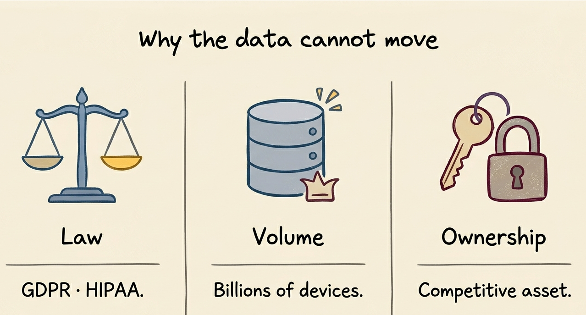
*Figure 2. Three separate forces — law, volume, and ownership — each
independently block the centralization of sensitive data.*

### The rules would not allow it

Some data is protected by law, and for good reason. Patient medical records,
bank transactions, personal communications — laws exist specifically to
prevent this data from being copied, shared, or moved without explicit
consent.

In Europe, this is **GDPR** (General Data Protection Regulation). In American
healthcare, it is **HIPAA** (Health Insurance Portability and Accountability
Act). These are not soft guidelines with minor consequences. They are hard
legal limits, and the data they protect most strictly is exactly the data
that would make machine learning models most powerful.

A hospital could improve a cancer detection model enormously by sharing its
patient scans with research centers around the world. But it legally cannot.
A bank could build a much better fraud detection system by pooling transaction
data with other banks. But it cannot do that either.

The most valuable training data in the world also carries the strictest
legal protection.

### The data was simply too big to move

Even when the law allows it, the volume makes centralization impractical.
Think about how much data is being generated every second across billions
of phones, hospital machines, factory sensors, and smart devices. Moving
all of that to a central server is not just a privacy problem. It is
physically unreasonable.

The bandwidth required to upload the typing behavior of a billion phones
every day would be staggering. The storage costs, the transfer time, the
energy consumption, all of it adds up to something that simply does not
scale in the real world.

### The data belonged to someone

Institutions often refuse to share their data and this is different from privacy protection.

A hospital's patient database is not just sensitive. It is valuable.
It represents years of clinical work, diagnostic expertise, and
infrastructure investment. Handing that to a competitor or a third party, is something most institutions
would never agree to. The data is an asset, and assets are not given away.

This is about ownership, not just protection.

Together, these three forces created a situation that no amount of
engineering could simply work around. The data was not going to move.
So the question became something different entirely: What if the model
moved instead?

## Federated Learning: The Elegant Workaround

Google's answer to the data problem was not to find a clever legal loophole
or build better anonymization tools. It was to rethink the whole pipeline entirely.

**Instead of bringing the data to the model, bring the model to the data.**

That single shift in perspective is what Federated Learning is built on.
Rather than collecting everyone's data on a central server and training
there like traditional centralized ML, the server sends the model out to each device. Each device trains
locally on its own private data, then sends back only a small mathematical
summary of what it learned. The raw data never moves. It never leaves the
device.

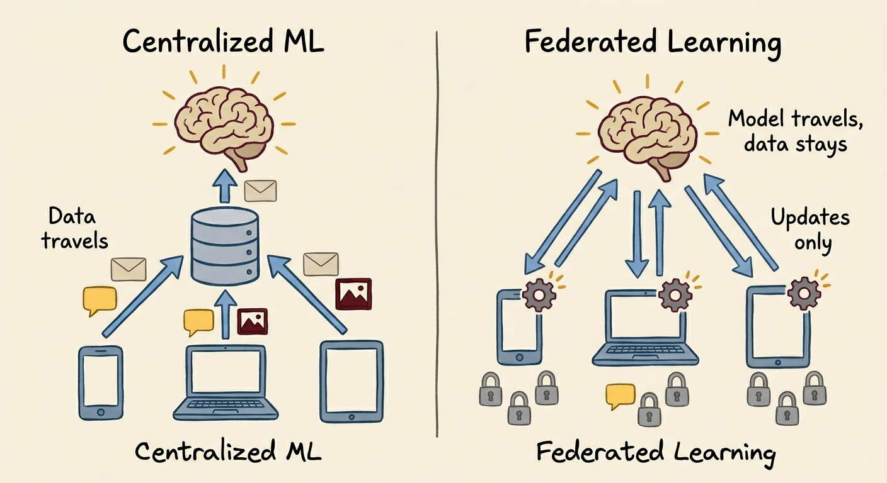
*Figure 3. In centralized ML the data moves to the model. In FL the model moves to the data.*

The name comes from the idea of a federation: a group of independent
participants working toward a shared goal without giving up their autonomy.

### Starting with the Intuition

The math behind FL will come in a moment. But first, here is a picture that makes the whole idea snap into place.

Imagine a teacher who wants to write the perfect textbook. She has a
hundred students scattered across the world, each with their own private
library of books she cannot access. Instead of asking them to send her
their books, she sends them a draft of the textbook. Each student reads
the draft, studies their own library, and marks it up with corrections
based on what they know. They send back the marked-up draft, not their
books. The teacher collects all one hundred marked-up drafts, averages
the corrections, and produces an improved draft. She repeats this many
times until the textbook is excellent.


*Figure 4. The teacher sends a draft and receives corrections. She never sees the students' libraries.*

That is federated learning. The textbook is the global model. The
corrections are the gradient updates. The students are the clients.
The teacher never sees their libraries.


### The FedAvg Algorithm

The algorithm behind this is called **FedAvg** (Federated Averaging),
Here is exactly how one round of FL works.

The server holds a global model with weights $w$. It randomly selects a
fraction $C$ of the available clients and sends them the current model.
Each client trains the model privately on their own local data, then sends
back only the updated weights (gradients). The server combines all the updates into a
new global model and starts the next round.

Three parameters control how the training runs:

- **C** — the fraction of clients selected each round
- **E** — how many local training episodes each client runs before sending back
- **B** — the size of each mini-batch during local training. Instead of using all local data at once
for each gradient step, the client randomly
samples a small batch of B examples, computes the gradient on just those,
updates the weights, then samples another batch. Smaller B means more
gradient steps per epoch and faster convergence in practice. Setting
B = ∞ means the client uses all its local data as a single batch.

**The objective.** The server wants to minimize the average error across
all training examples everywhere:

$$\min_{w} \, f(w) = \frac{1}{n} \sum_{i=1}^{n} f_i(w)$$

Because the data is split across $K$ clients, this becomes a weighted
sum of each client's local loss:

$$f(w) = \sum_{k=1}^{K} \frac{n_k}{n} \, F_k(w)$$

Where $n_k$ is the number of data points at client $k$, $n$ is the total,
and $F_k(w)$ is how wrong the model is on that client's private data.

**What each client does.** After receiving the global model, each client
runs gradient descent locally for $E$ epochs:

$$w^k \leftarrow w^k - \eta \, \nabla F_k(w^k)$$

Where $\eta$ is the learning rate, the size of each update step.

**What the server does.** 
After receiving all the updated weights, the server computes a weighted average:

$$w_{t+1} = \sum_{k \in S_t} \frac{n_k}{n} \, w^k_{t+1}$$

Clients with more data pull the average more toward their local model.
A hospital with 10,000 patient records contributes far more than one
with 500.

**The full algorithm in pseudocode:**
    SERVER:
      initialize w₀
      for each round t = 1, 2, 3, ...:
          select m = max(C × K, 1) clients at random
          send current model wt to each selected client
          receive updated weights from each client
          compute new global model:
              w_{t+1} = Σ (nk / n) × w^k_{t+1}

    CLIENT (runs locally, data never leaves):
      receive model w from server
      for each local epoch 1 to E:
          for each mini-batch of size B:
              w ← w − η × gradient
      send updated w back to server

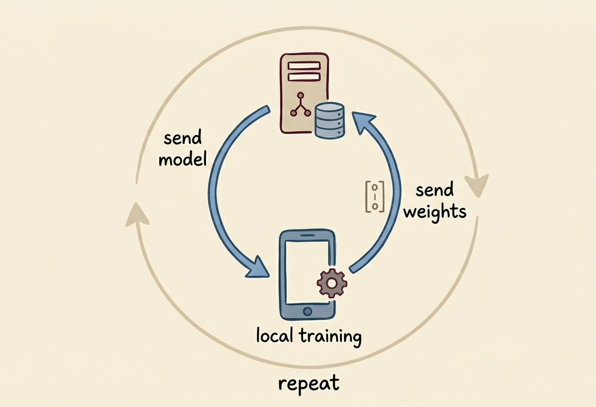
*Figure 5. A single round of FedAvg: the model leaves the server, gets trained locally, and comes back changed.*

## When the Math Creates Unfairness

The weighted average at the heart of FedAvg works beautifully under one
assumption: that all clients are drawing from the same statistical
population. Different samples, but the same underlying world. In machine
learning, this is called the **IID assumption**. Independently and
identically distributed data.

In federated learning, this assumption is almost never true.

### The Non-IID Problem


*Figure 6. IID means drawing from the same deck. Non-IID means every client has a completely different one.*

IID would mean every hospital sees roughly the same mix of patients, every
phone user types in the same way, every bank serves the
same customer profile. Like a deck of cards split randomly among players. different hands, but from the same deck.

Non-IID means the clients are playing with completely different decks.

Consider a federated learning system training a model to detect pneumonia
from chest X-rays across three hospitals:

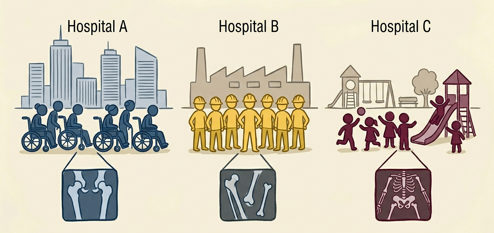
*Figure 7.*

- **Hospital A** is a large urban hospital serving mostly elderly patients.
Its X-rays are full of age-related findings —-> bone density changes,
calcification, conditions common in older adults.

- **Hospital B** serves a rural population with younger patients and
different infection patterns —-> malnourishment-related findings, different
anatomical presentations.

- **Hospital C** is a pediatric hospital. Its X-rays show children's
anatomy almost exclusively, which looks fundamentally different from
adult scans.

These three hospitals are not drawing from the same deck. They are living
in different statistical worlds. And when FedAvg averages their model
updates together, it uses this formula:

$$w_{t+1} = \sum_{k=1}^{K} \frac{n_k}{n} \, w^k_{t+1}$$

Let us put real numbers to this. Suppose Hospital A has 10,000 records
and Hospital C has 500. The total is 10,500.

$$\text{Hospital A's weight} = \frac{10{,}000}{10{,}500} = 0.952$$

$$\text{Hospital C's weight} = \frac{500}{10{,}500} = 0.048$$

Hospital A controls 95.2% of the global model update. Hospital C
controls 4.8%.

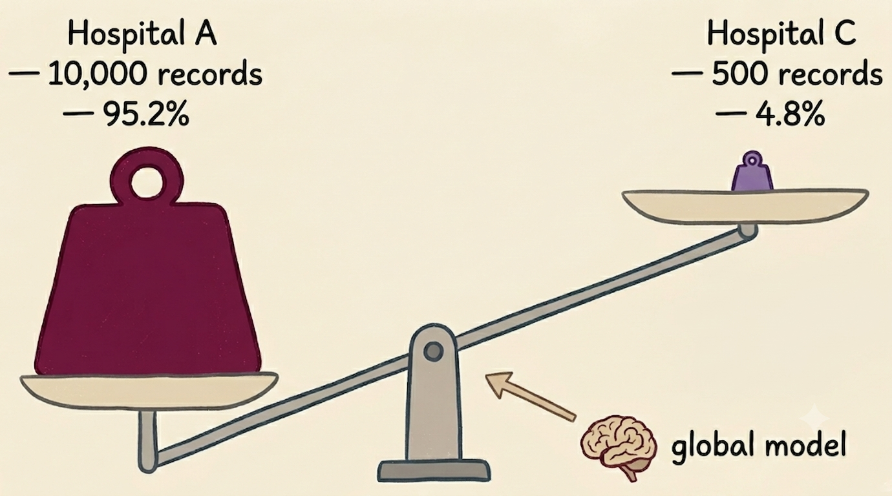
*Figure 8. Hospital A controls 95% of the global model update. Hospital C controls 4.8%.*

The global model is, mathematically, almost entirely Hospital A's model.
Children are now being diagnosed by a system where their data contributed
less than 5% of the learning signal. The model was not designed to be
unfair. The math made it unfair without anyone noticing.

And this is the uncomfortable part: if you just look at overall accuracy,
the model might seem fine. It performs well on elderly patients, who make
up the bulk of the evaluation data. The failure on pediatric cases hides
behind the average.

### Why XAI Is the Only Way to See This

This is the first place in the federated learning story where explainability
becomes not just useful but necessary.

If you run a Shap on each hospital's local model separately, something revealing appears.
Hospital A's model leans heavily on features like bone density and calcification. Because that is what its
data looks like. Hospital C's model barely uses those features at all.

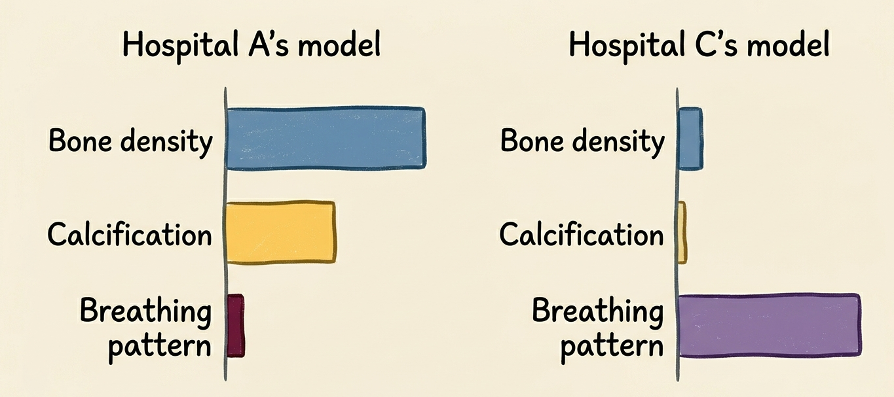
*Figure 9. The disagreement in feature importance between local models is the fingerprint of the bias.*

That disagreement in feature importance is the fingerprint of the bias.
It tells you, without ever accessing the raw data, that these two models
have learned from fundamentally different populations, and that blending
them naively is producing a global model that represents neither well.

Without this kind of analysis, the bias is invisible. The global model
just quietly underperforms on children, and without the right tools to
look inside it, nobody knows why.

This is not the only problem that explainability needs to solve in
federated learning. There is something more alarming that the research
community discovered. A different paper landed that made everyone stop and reconsider
something much more fundamental, the very foundation of the
privacy guarantee that makes FL worth using in the first place.

## The Privacy Illusion

Here is something the federated learning community believed for years:
gradients are safe to share.

It seems reasonable. A gradient is not your data. It is just a mathematical
derivative, a vector of numbers describing how the model's error changes
with respect to its weights.
How much information about the original data could it possibly contain?

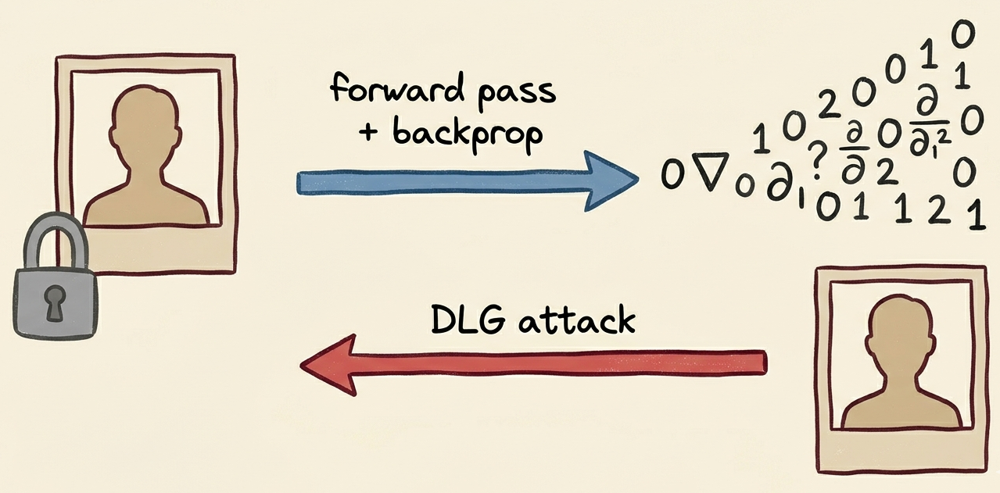
*Figure 10. A gradient looks like meaningless numbers. DLG proved it carries the original data inside it.*

In 2019, three researchers at MIT — Zhu, Liu, and Han — decided to
actually test this assumption. Their paper, *Deep Leakage from Gradients*,
published at NeurIPS 2019, proved that the assumption was completely wrong.

### The Attack

Given only the gradient that a client sends and nothing else, an attacker
can reconstruct the client's original private training data. Pixel by pixel
for images. Token by token for text.

Here is how the attack actually works.

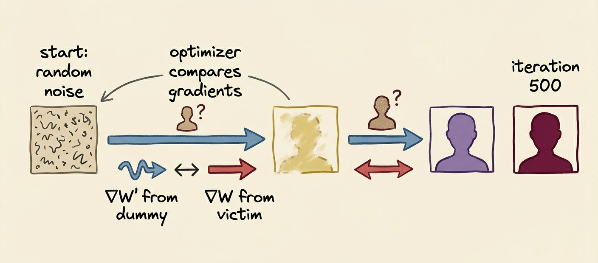
*Figure 11.*

The attacker has access to three things: the model architecture $F$, the
current model weights $W$, and the gradient $\nabla W$ that the victim
client just sent. The first two are public by design, every participant
in a federated system needs them. The third is what the client sent across
the network.

The attacker starts with a completely random fake image $x'$ and a random
fake label $y'$. Think of them as pure visual noise — meaningless static.
They run this fake data through the exact same model the victim used, and
get what you might call dummy gradients:

$$\nabla W' = \frac{\partial \, \ell(F(x', W), \, y')}{\partial W}$$

run the fake input $x'$ through the model $F$ with weights $W$, 
compute the prediction error $\ell$, then calculate
how that error changes with respect to the weights $W$. The result is the
gradient that the fake data would have produced.

Now the attacker has two gradients: the real one $\nabla W$ intercepted
from the victim, and the fake one $\nabla W'$ produced by their dummy data.
They measure the distance between them:

$$\mathcal{D} = \| \nabla W' - \nabla W \|^2$$

This is just the squared difference between two vectors, a single number
telling you how far apart the two gradients are. When $\mathcal{D} = 0$,
the gradients are identical.

So the attacker runs an optimization: adjust $x'$ and $y'$ step by step until
the dummy gradient matches the real one as closely as possible (minimize the distance)

$$x^{*}, \, y^{*} = \arg\min_{x', y'} \left\| \frac{\partial \, \ell(F(x', W), y')}{\partial W} - \nabla W \right\|^2$$

Simply means: find the values of $x'$ and $y'$
that make the expression inside as small as possible. In practice this is
just gradient descent but instead of updating the model weights, 
the attacker updates the fake image and label. 
The model stays frozen. The noise becomes a photograph.

When $\mathcal{D}$ gets close to zero, the fake input has converged to
something that produces the same gradient as the real private data. And
because gradients carry a mathematical fingerprint of the data that
generated them, that means the fake input has become a reconstruction of
the real one.

The algorithm in pseudocode:

    Input: model F, weights W, real gradient ∇W
    Output: reconstructed private data x, y

    Initialize x' and y' as random noise
    For i = 1 to n iterations:
        Compute ∇W' from x' and y'
        Measure distance D = ||∇W' − ∇W||²
        Update x' and y' to reduce D
    Return x', y'

### What the Results Showed

The researchers tested this on four datasets --> handwritten digits, natural
images, street numbers, and face photographs. In every case, they started
from pure random noise and optimized toward the real data.

By iteration 10, shapes began to emerge. By iteration 100, the image was
clearly recognizable. By iteration 500, the reconstruction was nearly
pixel-perfect.

The face photographs are the most striking result. By the end of
optimization, the reconstructed face is almost indistinguishable from the
ground truth. A real person's face! rebuilt from nothing but a gradient.

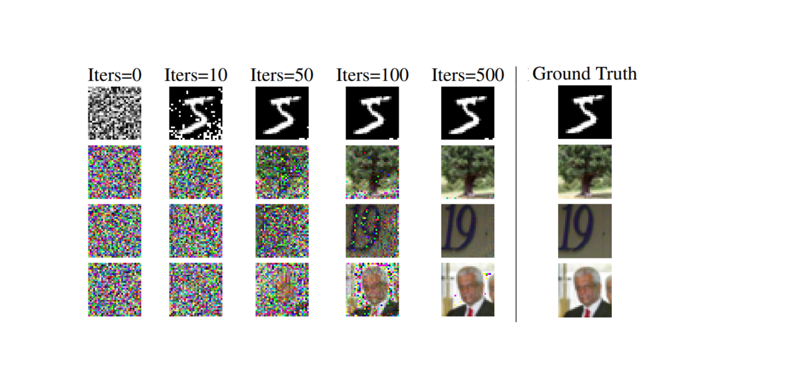
*Figure 12. Starting from pure noise (left), the DLG attack progressively
reconstructs the original private image. By iteration 500, the result is
nearly identical to the ground truth.*


### The Defense That Costs Too Much

The most natural defense against DLG is to add noise to gradients before
sharing them. This is the principle behind **differential privacy**. By
injecting controlled randomness into the gradient, you make reconstruction
impossible.

It works. But at a price.

The paper showed that noise with variance above $10^{-2}$ successfully
blocks the attack. At that noise level, model accuracy on CIFAR-100
drops from 76.3% to 45.3%. You defended against the attack but produced
a model that is barely useful.

Every defense that actually works against DLG also degrades the model.

After DLG, the federated learning community was sitting with something
genuinely uncomfortable. The data is invisible. The gradients are dangerous. 
And the global model built from all of this is a complete black box that nobody
can fully inspect.

A model that makes wrong decisions is not just inefficient. It is dangerous.
And a wrong decision that nobody can explain is not just dangerous.
It is indefensible.

So If the model is built from data nobody can see, how do you trust it?
How do you explain its decisions? How do you know it is being fair?
How do you know nobody tampered with it?

This is where explainability enters the picture. Not as an academic
exercise, but as a practical necessity.

## Why Explainability Cannot Be Optional

In federated learning specifically, explainability is not a nice-to-have
feature. It is a requirement that the system cannot function without, for
three distinct reasons.

### Trust

If a hospital is going to use a federated model to help diagnose cancer,
the doctor needs to understand why the model made that prediction. Not
just that it predicted cancer but wht. What features drove the decision.
What the model was looking at.

Saying "the federated global model says so" is not a sufficient
justification for a clinical decision. Under the EU AI Act, which requires
explainability for high-risk AI systems, it is not even a legal one. A
doctor cannot explain a treatment decision to a patient by citing a black
box trained on data from hospitals they have never heard of.

Without explainability, federated learning cannot be deployed where it
matters most. The model may exist and perform well on benchmarks. But
in practice, nobody will use it.

### Fairness

We already saw this problem in the non-IID section. When Hospital A
dominates the weighted average with 95% of the update, the global model
is shaped almost entirely by elderly patient data. Hospital C's children
are being diagnosed by a system that barely learned from them.

XAI makes invisible unfairness visible.

### Security and Debugging

DLG showed that a malicious server can reconstruct training data from
gradients. But the attack can run in the other direction too. A malicious
client can send deliberately corrupted gradients designed to push the
global model toward wrong behavior. This is called a **poisoning attack**,
and in a federated system it is exceptionally hard to detect because the
server never sees the client's training data.

When a federated model fails you need to understand where the failure
came from. Was it one client's unusual data distribution? A poisoned
update from a compromised participant? A flaw in the aggregation step?

Without explainability tools, you are debugging a black box built from
a process you never fully observed, using data you never had access to.
You cannot audit what you cannot see.

These three pressures make explainability urgent in federated learning in a way that goes beyond
the usual arguments for XAI in standard machine learning. The stakes are
higher, the system is more opaque, and the failure modes are harder to
detect.

The problem is that the tools built to provide this explainability were
designed for a completely different world.

## The Core Tension: XAI Needs What FL Forbids

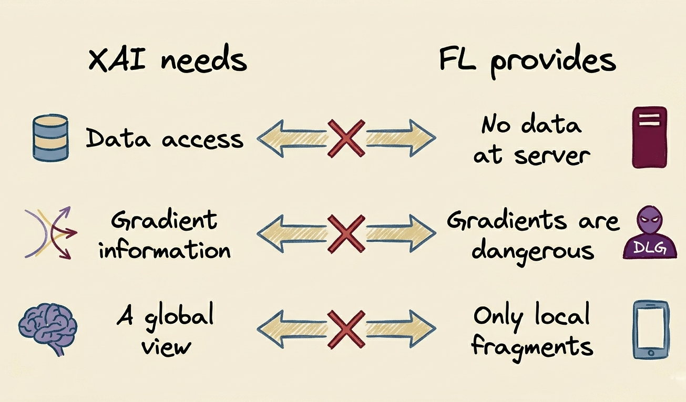
*Figure 13.*

Post-hoc explanation methods were designed for a world where data is
accessible. SHAP works by perturbing input features and observing how
predictions change. LIME builds a local approximation by generating
thousands of synthetic samples around a real data point. Gradient-based
saliency maps backpropagate through the model using specific training
examples.

Every one of these methods requires either access to data, access to
gradient information, or both.

Federated learning was built specifically to prevent both.

The server has no data. The gradients are dangerous to expose. The global
model was built by averaging updates from clients whose data nobody can
centrally access. The most important place to apply explainability "the
global model" is also the place with the least information available to
explain it.

So how do researchers respond to this? They went in four directions. 
each making a different trade-off between how much you can explain and
how much privacy you give up to do it.

---

### 1. Local Explainability

The most natural starting point is to keep everything local. Each client
runs an explanation method on their own model using their own private data.
The analysis never leaves the device. The privacy constraint is fully
satisfied.

A hospital runs SHAP on its local model using its own patient records.
A phone generates its own saliency map from its local training data.
No cross-client data sharing. No privacy risk.

The limitation is significant though. You now have as many explanations
as you have clients, and no coherent global picture. Hospital A's
explanation and Hospital C's explanation disagree on which features matter.
Neither one describes the global model which was built by averaging all
of them. Local explanations are fragments of a truth that nobody can see
whole.

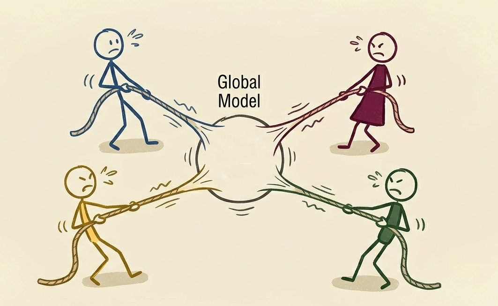
*Figure 14. One hundred local explanations exist. The global explanation does not.*

---

### 2. Privacy-Safe XAI Adaptations

If the problem is that XAI needs data the server does not have, the next
logical move is to give it something that behaves like data without
actually being data.

**Synthetic data** is the most common approach. Each client trains a
generative model such as a GAN (Generative Adversarial Network) on their local private data,
then shares the generator rather than the data itself. The server uses this generator
to produce synthetic samples that statistically resemble the real data
and runs SHAP or LIME on those synthetic samples.

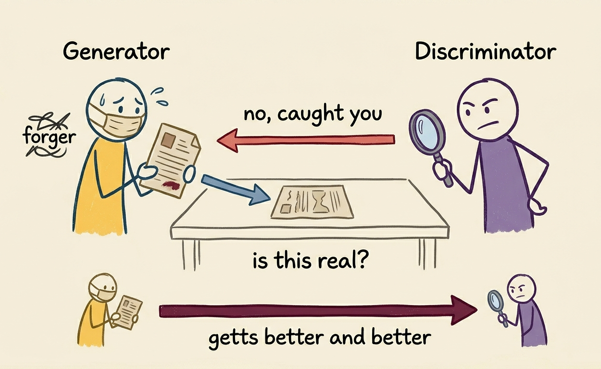
*Figure 15. The generator and discriminator compete until the fake becomes indistinguishable from real.*

A GAN works through competition. A generator network tries to produce
fake data that looks real. A discriminator network tries to catch the
fake. They train against each other until the generator produces data
realistic enough that the discriminator cannot tell it apart from real
examples. The synthetic output preserves the statistical patterns of the
original data without exposing any individual record.

The risk is that a very faithful generator might still leak private
information. This is usually addressed by adding differential privacy
noise to the generator during training. Which, as we saw earlier,
introduces its own accuracy trade-off.

**Model inversion** takes a completely different route. Instead of
generating new data from scratch, it asks: given the model's weights,
what kind of input would make the model most confident about a specific
class?

Think of it like reverse-engineering a recipe from the finished dish.
The server runs an optimization on the global model, not to improve
predictions, but to find the input that would produce the strongest
possible prediction for each class. The result is a reconstructed
representative input: what a "typical" pneumonia scan, or a "typical"
fraudulent transaction, looks like according to what the model has
learned.

No client data is needed at all, only the global model, which the
server already holds. The limitation is that inverted inputs are approximations. They reflect
what the model learned but may miss the nuances of the actual data
distribution.

**Public proxy datasets** Sometimes a publicly available dataset exists that is 
related to the problem but has no private data (a publicly released anonymized medical dataset for example)
The server runs explanation methods on
this proxy and treats the results as an approximation of the global
explanation. The quality depends entirely on how closely the proxy
resembles the real private data, which in sensitive domains like
healthcare is rarely well.

In practice, most privacy-safe XAI systems combine these approaches:
generate synthetic data, add noise, validate against a proxy. None of
them is perfect. All of them are honest compromises.

---

### 3. Intrinsic Interpretability

The most radical response to the tension is to sidestep it entirely by
choosing model architectures that do not need post-hoc explanation at all.

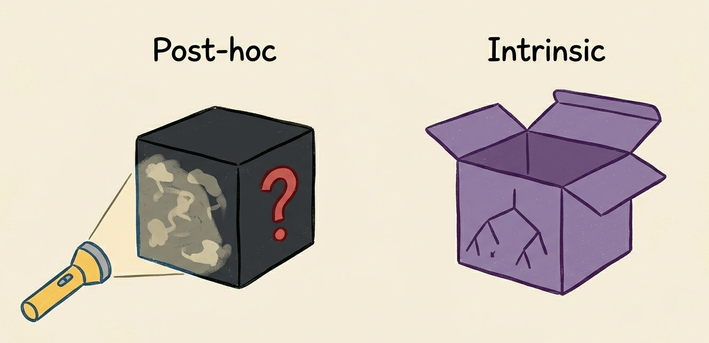
*Figure 16. One model needs a flashlight to see inside it. The other is already open.*

Post-hoc methods work by interrogating a black-box model from the outside.
Intrinsic interpretability means the model's reasoning is readable by
design. The explanation is built into the structure itself, not added
afterward.

A decision tree is the clearest example. A decision tree for detecting
loan default might produce a rule like: if monthly income is above €2,000
and credit history is longer than three years and debt ratio is below 0.4,
then predict no default. A loan officer can read every branch of that
tree. There is nothing to explain after the fact because the model is
already its own explanation.

In the federated context, this matters for a specific reason. Post-hoc
methods like SHAP and LIME require data to run. But if the model is intrinsically interpretable,
the server can read the decision rules directly from the aggregated global model without ever
touching a single client's private records.

The honest trade-off is accuracy. Decision trees and linear models are
less powerful than deep neural networks. For structured tabular data,
the gap is often acceptable. For complex inputs like raw images or free text, it
usually is not, and the system is forced back toward deep networks and
the post-hoc problem.

---

### 4. Client Contribution Analysis

The previous three approaches focus on explaining the model's predictions.
This one asks a different question entirely: can we explain the training
process itself?

The idea comes from cooperative game theory, where the question is: if a
group of players cooperate to achieve an outcome, how do you fairly divide
the credit? The Shapley value is the mathematically principled answer —
each player receives credit equal to their average contribution across
every possible ordering in which they could join the group.

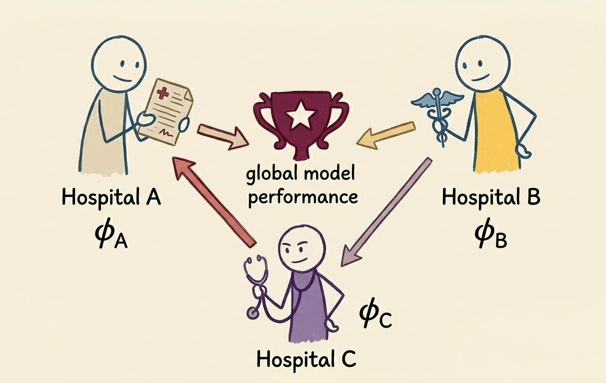
*Figure 17. Credit is distributed proportionally to actual contribution, not equally among all participants.*

Applied to federated learning, the players are clients and the outcome is
model performance. The Shapley value of client $k$ asks: on average, how
much does the global model improve when client $k$ participates, compared
to when it does not?

Formally:

$$\phi_k = \sum_{S \subseteq K \setminus \{k\}} \frac{|S|! \, (|K| - |S| - 1)!}{|K|!} \left[ v(S \cup \{k\}) - v(S) \right]$$

This looks dense but the idea is straightforward. $S$ is any group of
clients that does not yet include client $k$. $v(S)$ is how well the
model performs when trained on just those clients. $v(S \cup \{k\})$ is
how well it performs when client $k$ is added. The difference is client
$k$'s marginal contribution to that particular group. The formula averages
this across every possible group and every possible order of joining.

A simpler way to read it:

$$\phi_k = \mathbb{E}_{S} \left[ v(S \cup \{k\}) - v(S) \right]$$

The Shapley value is the expected performance gain from adding client $k$
to a randomly assembled group. A hospital with rich, rare patient data
will show a high Shapley value — adding it reliably improves the global
model. A client with redundant or corrupted data will show a near-zero
or negative value — including it adds noise rather than signal, which can
itself be a security signal worth investigating.

The computational challenge is real: exact Shapley computation requires
evaluating every possible subset of clients, which grows exponentially.
With $K$ clients there are $2^K$ subsets to consider. For a hundred
clients that is more combinations than there are atoms in the observable
universe. In practice, researchers use Monte Carlo approximations —
randomly sampling many orderings and averaging the marginal contributions
observed — which gives a reliable estimate at a fraction of the cost.


These four approaches represent the current toolkit for explaining
federated models. But there is a fifth direction that emerged from the
research, and it is perhaps the most surprising one. Several groups
discovered that XAI methods, embedded directly into the training loop
rather than applied after it, do not just explain what the model learned.
They make the training process itself more robust, more secure, and
harder to corrupt.

## XAI as a Security Tool

Everything described so far treats XAI as something that happens after
federated training. A layer of analysis applied to a finished model to
make it more understandable. Train first, explain later.

What several research groups found is that this framing is too narrow.
When XAI methods are embedded directly into the FL training loop, they
do not just produce explanations. They actively improve the quality,
fairness, and security of the training process itself.

XAI stops being a passive observer. It becomes a participant.

### 1. Using SHAP for Smarter Client Selection

In standard FedAvg, which clients participate in each round is decided
randomly. A fraction $C$ of available clients is selected uniformly at
random, and the process repeats. This works, but it wastes rounds on
clients whose updates add little new information.

One approach replaces random selection with explanation-guided selection.
The server maintains a small public reference dataset "not private data",
just a general benchmark dataset available to anyone. It runs the global
model on this reference data and computes SHAP values, producing a
picture of what the current global model considers important.

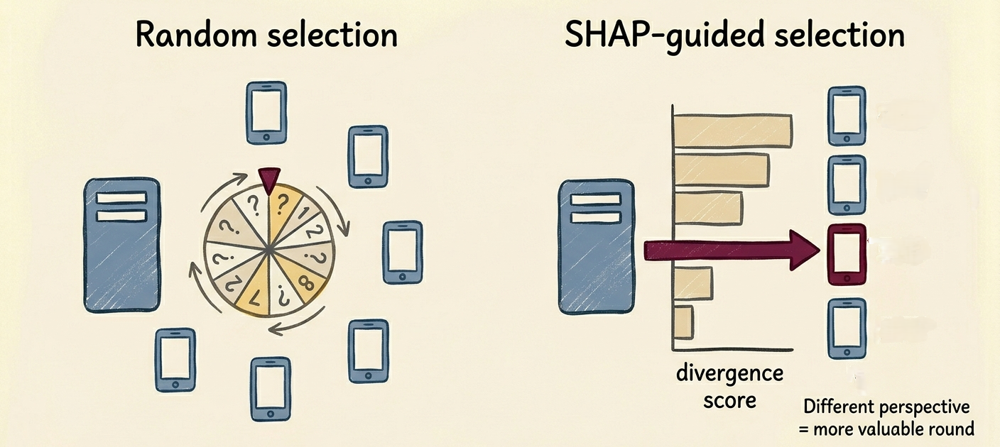
*Figure 18. SHAP divergence scores replace random selection with informed prioritization.*

Each client also computes SHAP values locally on their own data and their
own local model. The difference between a client's local SHAP values and
the server's global SHAP values measures how much that client's perspective
diverges from the global average. A large divergence means the client
holds unique, underrepresented knowledge.

Clients with the largest divergence get prioritized for the next round.
The result is a training process that actively seeks out the clients who
will contribute the most new information, rather than treating all
participants as equally valuable regardless of what they know.

The reported outcome is improved accuracy and faster convergence compared
to standard FedAvg. The explanation tool is making training decisions.

### 2. Using LIME to Detect Poisoned Clients

Detecting poisoning attacks in federated learning is genuinely difficult
because the server never sees the training data that produced a suspicious
gradient. The attack is invisible at the source.

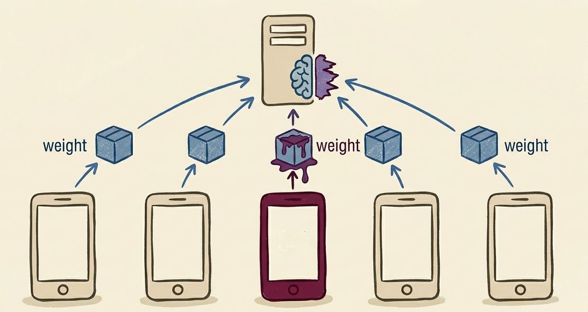
*Figure 19. One compromised client sends a corrupted gradient that quietly pulls the global model in the wrong direction.*

One approach builds a detection mechanism out of local explanations. Each
client trains two models in parallel: a deep neural network for the actual
prediction task, and a random forest for transparency and auditing.

A random forest is an ensemble of many decision trees trained on different
random subsets of the data, voting together on predictions. Unlike deep
networks, random forests have built-in feature importance, you can
directly ask which features drove each decision. The deep network handles
accuracy. The random forest handles interpretability.

For every sample that the deep network misclassifies, LIME computes which
features of the random forest drove that wrong prediction. The key signal
is how this feature importance changes over time. In an honest client,
the features driving misclassifications are stable and make domain sense.
In a compromised client, unusual features suddenly become highly important
for wrong predictions, features that have no legitimate reason to be
influential in that context.

The change in feature importance over time becomes the detection signal.
XAI is no longer just explaining errors. It is catching attacks.

### 3. Using GradCAM to Expose Backdoors

A backdoor attack is a specific and particularly dangerous form of
poisoning. The attacker does not try to degrade the model generally.
Instead, they train it to behave normally on all inputs except one:
whenever a specific hidden trigger is present, the model produces a
specific wrong output that only the attacker knows to expect.

The classic example: a stop sign recognition model works correctly on
every real stop sign. But the attacker has trained it so that a small
yellow sticker in the corner of a stop sign causes the model to classify
it as a speed limit sign. To anyone observing the model, it looks
completely normal. The attacker can exploit it at will.

In federated learning, the attacker is one of the clients. They train
their local model on images with the trigger labeled incorrectly, and the
poisoned gradient bakes the backdoor subtly into the global model. The
server never sees the images, only the gradient.

GradCAM (Gradient-weighted Class Activation Mapping) is a visualization
method that highlights which regions of an input image most influenced
the model's prediction. For a legitimate model classifying a stop sign,
GradCAM highlights the octagonal shape, the red color, the word STOP.
For a backdoored model, GradCAM highlights the yellow sticker in the
corner, something completely irrelevant to the classification task.

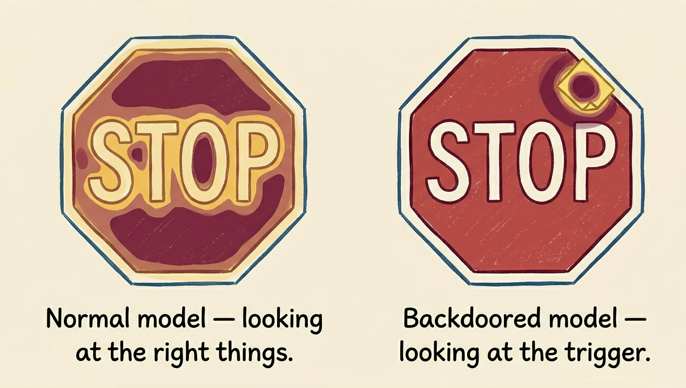
*Figure 20. The model works correctly on every input except one — the one the attacker chose.*

By running GradCAM on the global model across a set of test images, an
auditing system can catch this pattern. If the explanation consistently
draws attention to irrelevant regions, a backdoor is present.
The explanation method sees what the model was taught to hide.

### 4. Using SHAP to Block Adversarial Data Poisoning

A GAN-based poisoning attack works by using a generative model to produce
adversarial examples, inputs specifically engineered to fool the model.
These adversarial examples are mixed into a client's training data. The
model learns to misclassify them in whatever way the attacker wants, while
continuing to work correctly on natural inputs.

The defense uses SHAP in an unexpected way. At each client, SHAP
identifies which input features "which pixels, in the case of images"
are most important to the current local model's predictions. Those
high-importance features are then masked before training. Replaced with
zeros or noise.

The reasoning is this: GAN-based adversarial attacks work by making
tiny, precisely crafted perturbations to the pixels the model pays most
attention to. If those pixels are masked before the model ever sees the
training data, the adversarial perturbation has nothing to grab onto.
The attack loses its foothold.

By hiding the features the model cares about most, you make the model
harder to manipulate through those features. The explanation tool becomes
a shield.

---

The same methods designed to explain predictions are, in these
applications, selecting better training participants, catching compromised
clients, exposing hidden backdoors, and blocking adversarial attacks.
This dual role "explanatory and protective" is one of the more
surprising findings in this area of research, and it makes a strong
case that XAI in federated learning is not an afterthought. It is
infrastructure.

---

## Try It Yourself: The FL Playground

One of the best ways to build intuition for the concepts in this chapter
is to watch federated learning actually run. The FL Playground is an
interactive browser tool that lets you train a federated model in real
time, adjust all the key parameters, and observe how the global model and
the individual client models evolve.

You can access it here:
[**FL Playground**](https://oseltamivir.github.io/playground/)

Here is a suggested experiment that demonstrates the non-IID problem
directly:

**Setup:**

| Parameter | Value |
|---|---|
| Algorithm | FedAvg |
| Clients | 9 |
| Client fraction (C) | 0.2 |
| Local epochs (E) | 1 |
| Data heterogeneity | 10 |
| Data balance | 1 |
| Differential privacy | off |

Click **Run Federated** and watch the bottom row of panels showing the
nine local models. With heterogeneity at 10, each client sees a
different slice of the data and learns a completely different decision
boundary. The global model above struggles to reconcile them.

Then stop training, drag **Data Heterogeneity** down to 1, and run again.
The local models immediately become much more similar and the global model
converges cleanly. That visual difference is the non-IID problem.

Now check the **Differential Privacy** box while training. Watch what
happens to accuracy. That drop is the defense cost we saw in the DLG
paper, the same trade-off, made visible in real time.

## Where the Field Stands

Let us come back to where we started.

You. Your phone. A message you typed today that you would not want
anyone else to read.

Federated learning was invented so that message never leaves your device.
The model learns from your typing without Google ever seeing your words.
That privacy is real, and it matters, and the engineering behind it is
genuinely clever.

The research community has made real progress on the problem of
explainability in federated learning. The four approaches described in
this chapter, and the surprising dual role of XAI as a security tool,
represent genuine contributions. But honesty requires saying clearly that
the problem is not solved.

## An Honest Look at What Is Still Unsolved

The scoping review of 37 papers combining federated learning and XAI found
that only one study had ever quantitatively measured how much FL actually
changes the quality of model explanations compared to centralized training.
One. The field has been assuming the answer is roughly fine without
checking.

That gap is not a criticism of the researchers who produced this work.
It is a map of where the interesting problems still live.

No one has built a truly federated implementation of SHAP that works
under non-IID conditions without requiring centralized data access.
No one fully understands how aggregation distorts local explanations
when they are combined into a global picture. No one has settled on
evaluation metrics that fairly measure explanation quality in a
distributed system.

The field is young. The problems are real. And the work "building
systems that protect your data and can still be held accountable for the
decisions they make" is genuinely worth doing!

---

## References

McMahan, H.B., Moore, E., Ramage, D., Hampson, S., & Agüera y Arcas, B.
(2017). Communication-Efficient Learning of Deep Networks from
Decentralized Data. *Proceedings of the 20th International Conference on
Artificial Intelligence and Statistics (AISTATS)*. arXiv:1602.05629

Konečný, J., McMahan, H.B., Yu, F.X., Richtárik, P., Suresh, A.T., &
Bacon, D. (2016). Federated Learning: Strategies for Improving
Communication Efficiency. *NeurIPS Workshop on Private Multi-Party Machine
Learning*. arXiv:1610.05492

Zhu, L., Liu, Z., & Han, S. (2019). Deep Leakage from Gradients.
*Advances in Neural Information Processing Systems (NeurIPS 2019)*.
arXiv:1906.08935

Geiping, J., Bauermeister, H., Dröge, H., & Moeller, M. (2020).
Inverting Gradients: How Easy is it to Break Privacy in Federated
Learning? *Advances in Neural Information Processing Systems (NeurIPS
2020)*. arXiv:2003.14053

Lundberg, S.M., & Lee, S.I. (2017). A Unified Approach to Interpreting
Model Predictions. *Advances in Neural Information Processing Systems
(NeurIPS 2017)*. arXiv:1705.07874

Ribeiro, M.T., Singh, S., & Guestrin, C. (2016). Why Should I Trust You?:
Explaining the Predictions of Any Classifier. *Proceedings of the 22nd
ACM SIGKDD International Conference on Knowledge Discovery and Data
Mining*. arXiv:1602.04938

Lopez-Ramos, L.M., Leiser, F., Rastogi, A., Hicks, S., Strümke, I.,
Madai, V.I., Budig, T., Sunyaev, A., & Hilbert, A. (2024). Interplay
between Federated Learning and Explainable Artificial Intelligence: a
Scoping Review. arXiv:2411.05874

Zhu, H., Li, Z., Zhong, D., Li, C., & Yuan, Y. (2023).
Shapley-value-based Contribution Evaluation in Federated Learning:
A Survey. *IEEE 3rd International Conference on Digital Twins and
Parallel Intelligence (DTPI)*.

Yuan, X., Zhang, J., Luo, J., Chen, J., Shi, Z., & Qin, M. (2022).
An Efficient Digital Twin Assisted Clustered Federated Learning Algorithm
for Disease Prediction. *IEEE 95th Vehicular Technology Conference
(VTC2022-Spring)*.

Haffar, R., Sanchez, D., & Domingo-Ferrer, J. (2023). Explaining
Predictions and Attacks in Federated Learning via Random Forests.
*Applied Intelligence, 53*(1), 169-185.

Hou, B., Gao, J., Guo, X., Baker, T., Zhang, Y., Wen, Y., & Liu, Z.
(2021). Mitigating the Backdoor Attack by Federated Filters for
Industrial IoT Applications. *IEEE Transactions on Industrial
Informatics, 18*(5), 3562-3571.

Ma, X., & Gu, L. (2023). Research and Application of
Generative-Adversarial-Network Attacks Defense Method Based on
Federated Learning. *Electronics, 12*(4), 975.

---

## Citation

To cite this chapter, please use the following BibTeX:

```bibtex
@misc{elsharkawy_2026_XAI,
  author       = {Ahd El-sharkawy},
  title        = {Interpreting Machine Learning: A Gentle Introduction,
                  Chapter 8},
  year         = {2026},
  publisher    = {GitHub},
  howpublished = {\url{https://github.com/amrmsab/interpreting_machine_learning}},
}
```