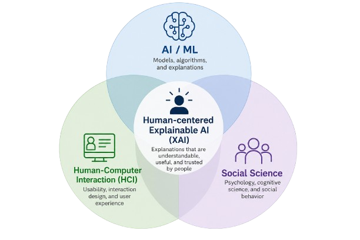
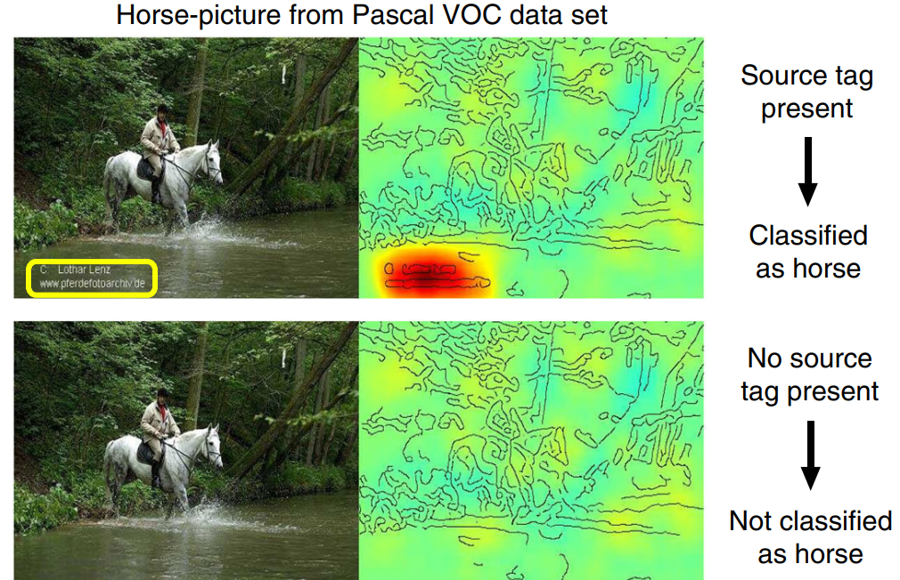

# Research Gaps and Future Directions in Explainable AI

**Author:** Youssef Niazy

---

## Introduction

Recent advances in artificial intelligence have significantly increased the use of complex machine learning systems in high-impact domains such as healthcare, finance, autonomous systems, and policy-making. As these systems become more powerful, concerns about transparency, accountability, and trustworthiness have also grown. Explainable Artificial Intelligence (XAI) emerged as an attempt to address these concerns by developing methods that help humans better understand how AI systems make decisions.

Over the last decade, the field of XAI has produced a wide range of explanation methods, including feature attribution techniques, saliency maps, counterfactual explanations, and interpretable surrogate models. However, despite this rapid progress, many researchers now argue that the central challenge is no longer simply generating explanations, but rather determining whether these explanations are reliable, faithful, useful, and aligned with human understanding.

Recent research has revealed several important limitations in current explainability approaches. Explanations may appear convincing while failing to reflect actual model reasoning, evaluation standards remain inconsistent across the field, and many explanation methods are still poorly aligned with human needs and real-world decision-making processes. At the same time, the rise of large language models and generative AI systems has introduced entirely new explainability challenges due to their scale, complexity, and emergent behavior.

This chapter focuses on the major research gaps and future directions in explainable AI. Rather than reintroducing foundational explainability concepts, the chapter critically examines unresolved technical, methodological, and human-centered challenges that continue to shape the field. It also explores emerging research directions, including faithfulness evaluation, mechanistic interpretability, causal explainability, interactive explanations, and explainability for modern AI systems.

---

## Research Gap 1: Evaluating Explanations

One of the most significant unresolved challenges in explainable AI is determining how explanations should be evaluated. While machine learning models are commonly assessed using well-defined metrics such as accuracy, precision, recall, or F1-score, evaluating explanations is considerably more difficult because explanation quality is often subjective, context-dependent, and strongly influenced by the needs of the user.

Doshi-Velez and Kim (2017) argue that the field still lacks a rigorous and standardized framework for measuring interpretability. They categorize evaluation approaches into three main levels: functionally-grounded evaluation, human-grounded evaluation, and application-grounded evaluation. Functionally-grounded approaches rely on proxy computational metrics without involving human participants, while human-grounded evaluation uses simplified human studies to measure interpretability. Application-grounded evaluation is considered the most realistic because it involves domain experts performing real tasks in practical settings, although it is significantly more expensive and difficult to conduct.

| Evaluation Type       | Description                                                 | Advantages                              | Limitations                              |
| --------------------- | ----------------------------------------------------------- | --------------------------------------- | ---------------------------------------- |
| Functionally-grounded | Uses proxy computational metrics without human participants | Fast and scalable                       | May not reflect real human understanding |
| Human-grounded        | Uses simplified human studies                               | Captures user interaction and usability | Limited realism                          |
| Application-grounded  | Uses domain experts performing real tasks                   | Most realistic evaluation setting       | Expensive and difficult to scale         |

A major problem is that explanation usefulness cannot always be measured using a single metric. An explanation that is useful for a machine learning engineer may not be understandable for a medical professional or a non-technical user. In many real-world applications, explanations must balance multiple competing objectives simultaneously, including simplicity, fidelity, completeness, stability, and computational efficiency.

As a result, current research increasingly focuses on developing more rigorous evaluation methodologies. One active research direction is explanation faithfulness, which studies whether explanations truly reflect the internal reasoning process of the model rather than simply producing convincing visualizations. Researchers have proposed several faithfulness-related evaluation techniques, including deletion and insertion metrics, sufficiency tests, comprehensiveness analysis, and feature perturbation experiments.

Another important direction is robustness evaluation. Researchers discovered that some explanation methods can become unstable under small input perturbations or adversarial modifications. This means that visually similar inputs may produce significantly different explanations, raising concerns about reliability and trustworthiness. Recent work therefore focuses on stability testing, adversarial robustness analysis, and sensitivity evaluation for explanation systems.

The growing need for reproducibility has also motivated the development of benchmarking frameworks and standardized evaluation datasets for XAI research. Current efforts aim to create more consistent evaluation protocols that allow researchers to compare explanation methods under common settings and realistic constraints. However, despite these advances, the field still lacks universal agreement on what makes an explanation truly trustworthy, interpretable, or useful across different domains and stakeholders.

---

## Research Gap 2: Human-Centered Explainability

Although many explainability methods are technically sophisticated, an important criticism of current XAI research is that explanations are often designed primarily from the perspective of researchers and engineers rather than the perspective of human users. In practice, explanations are communication tools intended to support human understanding, decision-making, and trust. As a result, explainability is not only a machine learning problem, but also a human-centered and cognitive problem.

Miller (2019) argues that many XAI systems are developed with limited integration of insights from social science and human psychology, despite decades of research on how humans generate and interpret explanations. Human explanations are often selective, contrastive, and context-dependent. People usually ask questions such as “Why this decision instead of another one?” rather than seeking a complete mathematical description of the model. However, many AI explanation systems still prioritize technical completeness over human interpretability.




*Figure 2. Human-centered explainable AI combines machine learning, human-computer interaction, and social science to design explanations that better support human understanding and decision-making.*

Another major challenge is that different stakeholders require fundamentally different explanation styles. A machine learning engineer may prefer detailed feature attribution scores or gradient visualizations, while a doctor or financial analyst may require concise, actionable reasoning connected to domain knowledge. Non-technical users may prioritize clarity and trust over technical detail. Designing explanation systems that simultaneously satisfy these different user groups remains an open challenge.

Recent research increasingly focuses on human-centered explainability, which combines machine learning with human-computer interaction (HCI), cognitive science, and usability research. Rong et al. (2024) surveyed user-centered XAI studies and found growing interest in evaluating explanations through human behavioral experiments, usability analysis, trust calibration, and interactive systems.

One important future direction is personalized explanations. Instead of generating the same explanation for every user, researchers are exploring adaptive explanation systems that modify explanation complexity, detail, and presentation style depending on the user’s expertise, goals, and context. Another rapidly growing area is interactive explainability, where users can ask follow-up questions, explore model behavior dynamically, and challenge explanation outputs rather than passively receiving static explanations.

Researchers are also studying multimodal explanations that combine visualizations, natural language, examples, and counterfactual reasoning to improve understanding. However, balancing human interpretability with model faithfulness remains difficult because explanations that are easier for humans to understand are not always the most accurate representations of the model’s internal reasoning process. This trade-off continues to be one of the central research challenges in human-centered explainable AI.

---

## Research Gap 3: Misleading Explanations and Shortcut Learning

One of the most concerning challenges in explainable AI is that explanations themselves can sometimes be misleading. In many cases, explanation methods produce visually convincing outputs while failing to accurately represent the true reasoning process of the underlying model. This creates a dangerous situation where explanations may increase user confidence without improving actual understanding or reliability.

A well-known example of this problem was demonstrated by Lapuschkin et al. (2019) through what they referred to as “Clever Hans predictors.” The term is inspired by the historical story of Clever Hans, a horse that appeared to perform mathematical calculations but was actually responding to subtle human cues rather than understanding arithmetic. Similarly, machine learning models may appear highly intelligent while actually relying on hidden shortcuts, dataset artifacts, or spurious correlations.

In one famous example, a neural network successfully classified images containing horses with high accuracy. However, explanation heatmaps later revealed that the model was not primarily focusing on the horse itself, but rather on a copyright or source tag that frequently appeared in horse images within the training dataset. When the source tag was removed, the model failed to classify the horse correctly. This demonstrated that high predictive accuracy did not necessarily indicate meaningful reasoning.




*Figure 1. Example of shortcut learning in the “Clever Hans” experiment, where the model focuses on a source tag instead of the horse itself (Lapuschkin et al., 2019).*

This problem is closely connected to shortcut learning, where models exploit easy statistical patterns in the training data instead of learning robust semantic representations. Shortcut learning has become a major concern in deep learning systems because many modern models are capable of identifying unintended correlations that humans may not notice during training.

Another important issue involves the reliability of saliency maps and feature attribution methods. Adebayo et al. (2018) showed that some saliency-based explanation methods fail basic “sanity checks.” In several cases, explanations generated for trained models looked visually similar to explanations generated for randomly initialized models, suggesting that the explanations were not strongly dependent on the actual learned model parameters.

As a result, current research increasingly focuses on explanation faithfulness, causal explainability, and mechanistic interpretability. Researchers are developing methods that move beyond surface-level visualizations toward explanations that more accurately capture internal model behavior. Emerging work in mechanistic interpretability attempts to analyze neural circuits, transformer attention mechanisms, and neuron activations directly in order to better understand how modern deep learning systems process information internally.

Researchers are also investigating adversarial robustness for explanations. Studies have shown that explanation outputs themselves can sometimes be manipulated through adversarial perturbations, allowing attackers to alter explanations while preserving the original model prediction. This creates additional safety and security concerns, particularly in high-stakes applications such as healthcare, finance, and autonomous systems.

Despite significant progress, the field still lacks reliable guarantees that explanations consistently reflect true model reasoning. Addressing shortcut learning, explanation instability, and explanation manipulation remains one of the most critical future directions in explainable AI research.

---

## Critical Perspective: Should We Explain Black-Box Models?

A major debate within explainable AI research concerns whether black-box models should be explained after training or whether high-stakes applications should instead rely on inherently interpretable models from the beginning. While many current XAI methods focus on generating post-hoc explanations for complex deep learning systems, several researchers argue that these explanations may not provide sufficient transparency or reliability in critical decision-making environments.

One of the strongest critiques comes from Rudin (2019), who argues that relying on explanations for black-box models can create a false sense of trust. According to this perspective, post-hoc explanations are often approximations that may fail to accurately capture the true internal reasoning process of the model. As a result, users may believe they understand the system while important hidden behaviors remain undetected.

This concern becomes particularly important in high-stakes domains such as healthcare, criminal justice, finance, and autonomous systems, where incorrect decisions can have severe real-world consequences. In these settings, explanations that are incomplete, unstable, or misleading may increase risk rather than reduce it. Rudin therefore argues that whenever possible, interpretable models should be preferred over black-box systems in critical applications.

Recent research increasingly explores interpretable-by-design approaches that attempt to balance predictive performance with transparency. Examples include decision sets, generalized additive models (GAMs), symbolic reasoning systems, sparse linear models, and rule-based architectures. Unlike post-hoc explanations, these models are designed so that their reasoning process can be directly inspected and understood.

At the same time, researchers recognize that modern deep learning systems often achieve superior performance in highly complex tasks such as image recognition, natural language processing, and generative modeling. This has motivated growing interest in hybrid approaches that combine powerful black-box architectures with interpretable modules or explanation layers.

Another emerging research direction involves sparse and modular neural architectures that aim to improve interpretability by separating reasoning into more structured computational components. Researchers are also exploring disentangled representations and concept-based learning systems that align model reasoning with human-understandable concepts.

The debate between explainability and interpretability remains unresolved. While interpretable models may improve transparency and accountability, black-box systems often provide superior predictive performance in highly complex tasks. Future research therefore continues to focus on finding practical ways to balance accuracy, transparency, reliability, and human trust in modern AI systems.

---

## Future Directions in Explainable AI

As explainable AI research continues to mature, the field is increasingly shifting from developing isolated explanation techniques toward building more reliable, human-centered, and accountable AI systems. Future progress will likely depend not only on improving explanation quality, but also on integrating explainability into broader AI safety, governance, and human-AI interaction frameworks.

One of the most promising future directions is causal explainability. Many current explanation methods are primarily correlation-based, meaning they identify statistical relationships without determining true cause-and-effect reasoning. Researchers are therefore exploring causal inference techniques, intervention-based analysis, and structural causal models to generate explanations that better reflect how model decisions are actually produced. Causal explainability is particularly important in domains where understanding underlying mechanisms matters more than identifying surface-level correlations.

Another rapidly growing area is interactive and conversational explainability. Traditional explanation systems often provide static outputs such as feature importance scores or heatmaps. However, future AI systems may allow users to actively explore model reasoning through dialogue, follow-up questions, and dynamic interaction. Interactive explainability aims to transform explanations from passive outputs into collaborative human-AI communication processes.

Researchers are also increasingly focusing on explainability benchmarks and standardized evaluation protocols. Current evaluation methods remain fragmented across different tasks and domains, making it difficult to compare explanation systems consistently. Future work is expected to introduce more rigorous benchmarking datasets, shared evaluation metrics, and reproducibility standards for explainability research.

Regulation and governance are also becoming major drivers of future explainability work. Global regulatory initiatives such as the European Union AI Act increasingly emphasize transparency, accountability, risk management, and auditing requirements for AI systems. As AI becomes more integrated into real-world decision-making, organizations may be required to provide meaningful explanations, documentation, and evidence of responsible model behavior.

Another important direction involves integrating explainability with broader responsible AI objectives such as fairness, robustness, safety, and alignment. Researchers increasingly recognize that explainability alone cannot guarantee trustworthy AI systems. Instead, explainability must operate alongside bias mitigation, uncertainty estimation, adversarial robustness, and governance mechanisms to support responsible deployment.

Finally, explainability research is gradually moving toward continuous monitoring and auditing systems rather than one-time explanations. Future AI systems may include built-in auditing frameworks capable of monitoring reasoning behavior, detecting anomalies, tracking uncertainty, and identifying harmful model behaviors over time. This shift reflects a broader movement from static explainability toward long-term AI accountability and oversight.

---

## Explainability in the Era of Modern AI Systems

The rapid emergence of large language models (LLMs), generative AI systems, and multimodal architectures has introduced entirely new explainability challenges that extend beyond traditional machine learning settings. Many existing explainability techniques were originally designed for relatively smaller models with fixed prediction outputs, such as image classifiers or structured-data prediction systems. However, modern AI systems now operate at significantly larger scales and produce dynamic, open-ended, and highly complex behaviors.

Large language models present particularly difficult explainability problems due to their massive parameter counts, emergent reasoning behavior, and conversational interaction capabilities. Unlike traditional classifiers that generate a single prediction, LLMs produce sequences of tokens through probabilistic generation processes that are difficult to interpret using conventional explanation techniques. In many cases, even model developers cannot fully explain why certain responses or behaviors emerge during inference.

Another major challenge involves hallucinations, where generative AI systems produce incorrect or fabricated information while presenting it confidently and fluently. Traditional explainability methods are often insufficient for identifying why hallucinations occur or how internal reasoning processes contribute to these failures. As a result, explainability research increasingly overlaps with AI safety, alignment, and reliability research.

One rapidly growing research direction is mechanistic interpretability, which attempts to reverse-engineer neural networks by studying their internal computational mechanisms directly. Researchers analyze attention heads, neuron activations, transformer circuits, and representation structures to understand how models internally process concepts, store information, and perform reasoning tasks. Unlike post-hoc explanation techniques, mechanistic interpretability focuses on understanding the actual internal computations performed by the model.

Researchers are also developing AI auditing systems capable of monitoring model outputs, factual consistency, uncertainty levels, and potentially harmful behavior in real time. These systems aim to provide continuous oversight rather than isolated explanations after predictions are generated.

Another emerging area involves self-explaining AI systems that can estimate uncertainty, communicate confidence levels, and generate structured reasoning traces during inference. However, recent studies suggest that generated reasoning traces, including chain-of-thought outputs, may not always faithfully represent the true internal reasoning process of the model. This creates additional challenges for explanation reliability in generative systems.

Future explainability research must also address autonomous and agentic AI systems that can perform multi-step reasoning, planning, and long-term decision-making. Explaining the behavior of AI agents operating across complex environments may require entirely new interpretability paradigms capable of tracking goals, memory usage, reasoning chains, and interactions over time.

As AI systems continue to grow in scale and autonomy, explainability will likely evolve from isolated visualization tools into comprehensive frameworks for transparency, auditing, monitoring, and governance. The future of explainability in modern AI systems will therefore depend heavily on integrating interpretability research with broader efforts in AI safety, alignment, and responsible AI development.

---

## Conclusion

Explainable AI has become one of the most important research areas in modern artificial intelligence due to the growing deployment of complex machine learning systems in high-impact domains. Over the past decade, researchers have developed a wide range of explanation methods designed to improve transparency, trust, and human understanding. However, despite this rapid progress, major research gaps and unresolved challenges continue to limit the reliability and effectiveness of current explainability approaches.

This chapter highlighted several critical issues facing the field, including the absence of standardized evaluation methodologies, the difficulty of designing truly human-centered explanations, the risk of misleading or unfaithful explanations, and the ongoing debate surrounding black-box models versus interpretable systems. It also explored how modern AI systems such as large language models and generative AI introduce entirely new explainability challenges due to their scale, autonomy, and emergent behavior.

Current research increasingly focuses on developing explanations that are not only visually convincing, but also faithful, robust, interactive, and aligned with human reasoning processes. Emerging directions such as causal explainability, mechanistic interpretability, continuous AI auditing, and interactive explanation systems demonstrate that the field is evolving beyond static visualization techniques toward more comprehensive frameworks for AI transparency and accountability.

At the same time, explainability alone cannot fully guarantee trustworthy AI systems. Future progress will likely require deeper integration between explainability research and broader efforts in AI safety, fairness, robustness, governance, and alignment. As AI systems continue to become more powerful and autonomous, the ability to meaningfully understand, evaluate, and monitor their behavior will become increasingly essential.

Ultimately, the future of explainable AI is not only about generating explanations, but about building AI systems whose reasoning can be critically examined, responsibly governed, and genuinely trusted by the humans who rely on them.

---

## References

- Adebayo, J., Gilmer, J., Muelly, M., Goodfellow, I., Hardt, M., & Kim, B. (2018). *Sanity checks for saliency maps*. Advances in Neural Information Processing Systems (NeurIPS).

- Doshi-Velez, F., & Kim, B. (2017). *Towards a rigorous science of interpretable machine learning*. arXiv preprint arXiv:1702.08608.

- Lapuschkin, S., Wäldchen, S., Binder, A., Montavon, G., Samek, W., & Müller, K. R. (2019). *Unmasking Clever Hans predictors and assessing what machines really learn*. Nature Communications, 10, 1096.

- Miller, T. (2019). *Explanation in artificial intelligence: Insights from the social sciences*. Artificial Intelligence, 267, 1–38.

- Rong, Y., Leemann, T., Nguyen, T. T., Fiedler, L., Qian, P., Unhelkar, V., Seidel, T., Kasneci, G., & Kasneci, E. (2024). *Towards human-centered explainable AI: A survey of user studies for model explanations*. IEEE Transactions on Pattern Analysis and Machine Intelligence, 46(4), 2104–2122.

- Rudin, C. (2019). *Stop explaining black box machine learning models for high stakes decisions and use interpretable models instead*. Nature Machine Intelligence, 1(5), 206–215.

---

## AI Usage Disclosure

Large language models were used to support brainstorming, structural organization, pedagogical refinement, and language improvement. All technical content, references, critical analysis, and final writing decisions were reviewed and validated by the author.


## Citation

```bibtex
@misc{niazy_2026_XAI,
  author       = {Youssef Niazy},
  title        = {Research Gaps and Future Directions in Explainable AI},
  year         = {2026},
  publisher    = {GitHub},
  howpublished = {\url{https://github.com/amrmsab/interpreting_machine_learning}},
}
```